# Class Diagram — Kiến trúc lớp VN-GO Travel (Cập nhật)

Sơ đồ lớp này phản ánh cấu trúc hệ thống hiện tại, bao gồm các dịch vụ điều phối trung tâm mới được bổ sung.

```mermaid
classDiagram
    direction TB

    %% ── Views & ViewModels ──────────────────────────────────────────────────
    class MapPage {
        -MapViewModel _vm
        -PeriodicTimer _timer
    }

    class MapViewModel {
        -LocationService _locationService
        -GeofenceService _geofenceService
        -INavigationService _navService
        -AppState _appState
        +UpdateLocationAsync() Task
        +LoadPoisAsync(string lang) Task
    }

    class PoiDetailPage {
        -PoiDetailViewModel _vm
    }

    class PoiDetailViewModel {
        -PoiDatabase _db
        -AudioService _audioService
        +LoadPoiAsync(string code, string lang) Task
    }

    %% ── Core Services — Navigation & State ────────────────────────────────
    class INavigationService {
        <<interface>>
        +NavigateToAsync(string route, IDictionary parameters) Task
    }

    class NavigationService {
        -SemaphoreSlim _navGate
        +NavigateToAsync(string route, IDictionary parameters) Task
    }

    class AppState {
        +bool IsModalActive
        +event ModalStateChanged
        +SetModalActive(bool active)
    }

    class PoiEntryCoordinator {
        -QrResolver _resolver
        -INavigationService _navService
        -PoiDatabase _db
        +HandleEntryAsync(PoiEntryRequest request) Task
    }

    %% ── External Inputs — QR & Deep Links ────────────────────────────────
    class QrResolver {
        +Parse(string payload) QrParseResult
    }

    class DeepLinkCoordinator {
        -PendingDeepLinkStore _store
        -PoiEntryCoordinator _coordinator
        +ProcessPendingAsync() Task
    }

    class DeepLinkHandler {
        -PendingDeepLinkStore _store
        +Handle(Uri uri) bool
    }

    %% ── Services — Logic & Content ────────────────────────────────────────
    class GeofenceService {
        -AppState _appState
        -AudioService _audioService
        +CheckLocationAsync(Location loc) Task
    }

    class PoiTranslationService {
        -PoiDatabase _db
        -ITranslationProvider _translator
        +GetOrTranslateAsync(string code, string lang) Task
    }

    class LangblyTranslationProvider {
        +TranslateAsync(string text, string from, string to) Task
    }

    class LanguagePackService {
        -IPreferredLanguageService _langPrefs
        +Packs ObservableCollection~LanguagePack~
        +EnsureAvailableAsync(string code, Page host) Task
    }

    %% ── Relationships ───────────────────────────────────────────────────
    MapViewModel --> INavigationService : điều hướng an toàn
    MapViewModel --> AppState : quan sát trạng thái modal
    
    GeofenceService --> AppState : dừng tracking nếu ModalActive == true
    
    PoiEntryCoordinator --> QrResolver : parse mã
    PoiEntryCoordinator --> INavigationService : chuyển trang
    
    DeepLinkCoordinator --> PoiEntryCoordinator : đẩy luồng vào app
    DeepLinkHandler --> PendingDeepLinkStore : lưu link tạm thời
    
    PoiTranslationService --> ITranslationProvider : dịch tự động
    ITranslationProvider <|.. LangblyTranslationProvider : implements
    ITranslationProvider <|.. GTranslateTranslationProvider : implements
    
    NavigationService ..|> INavigationService : implements
```

## Giải thích các thành phần mới

| Class | Vai trò |
|-------|---------|
| **`NavigationService`** | Một "Gatekeeper" cho việc điều hướng. Nó sử dụng `SemaphoreSlim` để đảm bảo không có hai lệnh điều hướng nào chạy cùng lúc, tránh được lỗi crash "duplicate navigation" phổ biến trong Shell. |
| **`AppState`** | Quản lý trạng thái toàn cục của ứng dụng. Một trong những vai trò quan trọng nhất là cờ `IsModalActive`, cho phép `GeofenceService` biết khi nào người dùng đang ở trong một màn hình pop-up để tạm dừng việc phát âm thanh tự động. |
| **`PoiEntryCoordinator`** | Hệ thống hóa việc vào một POI. Dù bạn quét QR, nhấn link từ web, hay chọn từ danh sách, tất cả đều đi qua Coordinator này để đảm bảo logic xử lý giống nhau. |
| **`LangblyTranslationProvider`** | Nhà cung cấp dịch thuật chính hiện tại, hỗ trợ dịch động và được lưu cache vào SQLite thông qua `PoiTranslationService`. |
| **`LanguagePackService`** | Quản lý các gói ngôn ngữ dưới dạng "giả lập tải về", cho phép người dùng bật/tắt các bộ ngôn ngữ cần thiết. |
