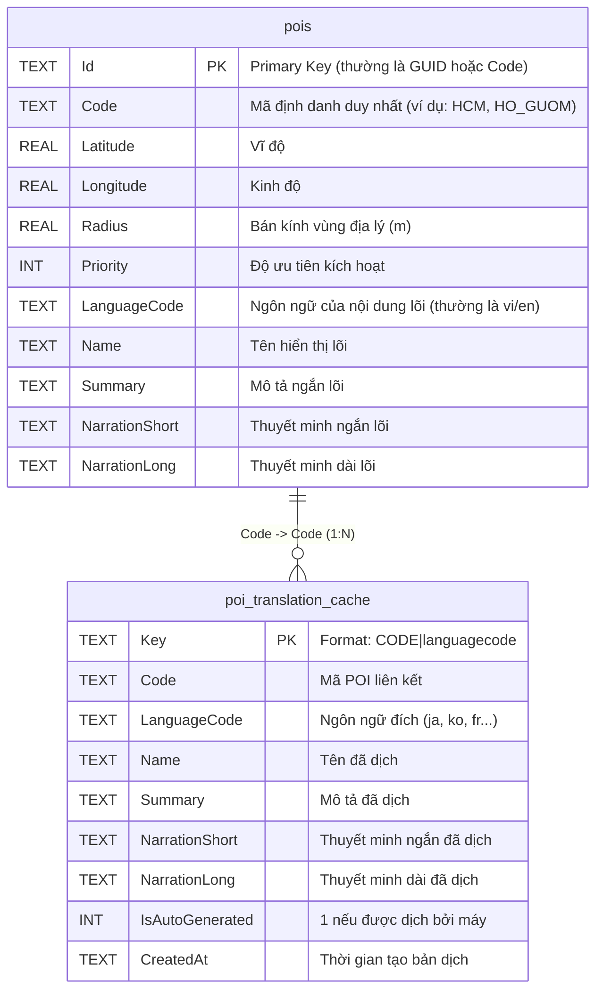
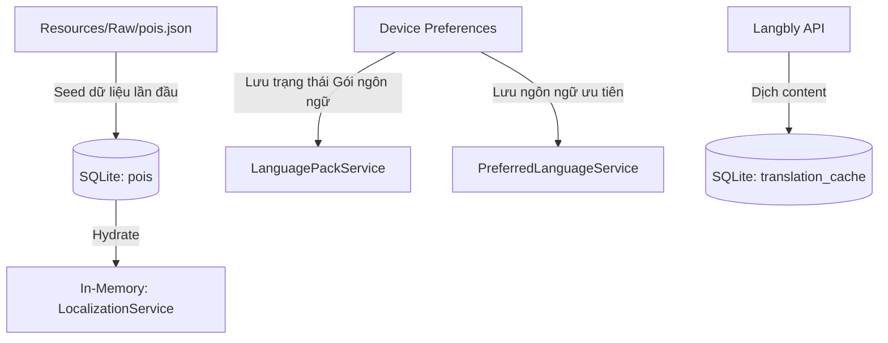

# ERD — Sơ đồ thực thể dữ liệu dự án (Entity Relationship Diagram)

Tài liệu này phản ánh cấu trúc dữ liệu thực tế đang được sử dụng trong ứng dụng VN-GO Travel, bao gồm các bảng SQLite vật lý và cơ chế lưu trữ logic.

## 1. Sơ đồ thực thể SQLite (Physical Schema)

### Chi tiết các bảng
- **`pois`**: Lưu trữ dữ liệu cơ bản của các địa điểm. Lưu ý rằng các cột Text (`Name`, `Summary`, ...) trong bảng này đóng vai trò là "nội dung gốc" (seed content) được nạp từ `pois.json`.
- **`poi_translation_cache`**: Lưu trữ các bản dịch tự động để hỗ trợ chế độ Offline và tiết kiệm chi phí API. Khóa chính `Key` được tạo bằng cách kết hợp `Code` và `LanguageCode`.

---

## 2. Mô hình Logic & Trạng thái (Conceptual Data Model)

Ngoài SQLite, hệ thống còn quản lý các dữ liệu trạng thái quan trọng khác qua `Preferences` (Android/iOS) và file tài nguyên.

### Dữ liệu ngoài Database
- **Gói ngôn ngữ (Language Packs)**: Trạng thái "Đã tải về" (`Downloaded`, `NotDownloaded`) được lưu trong `Preferences` với prefix `lang_pack_downloaded_`.
- **Cấu hình người dùng**: Ngôn ngữ ưu tiên hiện tại được lưu trong `Preferences`.
- **AppState**: Các trạng thái runtime như `IsModalActive` (để dừng Tracking GPS) được quản lý hoàn toàn trong bộ nhớ (In-memory singleton).
