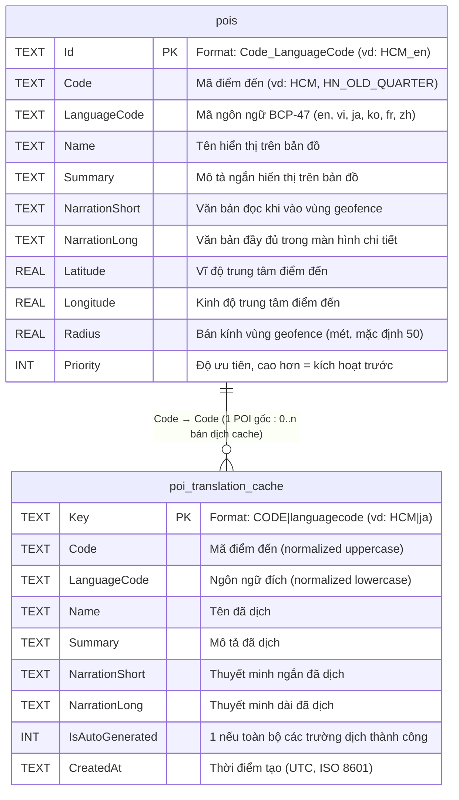

# ERD — Sơ đồ thực thể cơ sở dữ liệu (Entity Relationship Diagram)

## Chú thích mô hình dữ liệu

### Bảng `pois` — Dữ liệu điểm đến chính
- **Khóa chính `Id`** được ghép theo dạng `{Code}_{LanguageCode}` (vd: `HCM_en`, `HCM_vi`). Mỗi ngôn ngữ có một row riêng biệt — mô hình **flattened multilingual**.
- Dữ liệu gốc được seed từ `pois.json` đóng gói trong app bundle, upserted vào SQLite khi app khởi động (`LoadPoisAsync`).
- Index composite trên `(Code, LanguageCode)` hỗ trợ truy vấn ngôn ngữ với fallback (ưu tiên: ngôn ngữ yêu cầu → `vi` → `en` → bất kỳ).
- `NarrationShort` được dùng trong geofence trigger; `NarrationLong` dùng trong màn hình chi tiết POI.

### Bảng `poi_translation_cache` — Cache bản dịch tự động
- **Khóa chính `Key`** theo dạng `CODE|languagecode` (vd: `HCM|ja`), phân biệt với format `Id` của bảng `pois`.
- Bảng này **không thay thế** row `pois` — chỉ lưu kết quả dịch tự động (Google Translate via GTranslate library).
- `IsAutoGenerated = 1` chỉ khi **tất cả 4 trường** (Name, Summary, NarrationShort, NarrationLong) dịch thành công — đảm bảo cache consistency.
- `PoiTranslationService` tra cứu theo thứ tự ưu tiên: `pois` (exact) → `poi_translation_cache` → gọi API dịch mới → lưu cache.

### Ghi chú kỹ thuật
- Database: **SQLite** via `sqlite-net-pcl`, file `pois.db` trong `FileSystem.AppDataDirectory`.
- Cả hai bảng được khởi tạo bởi `PoiDatabase.InitAsync()`, sử dụng `CREATE TABLE IF NOT EXISTS` và `ALTER TABLE ADD COLUMN IF NOT EXISTS` để hỗ trợ migration tương thích ngược.
