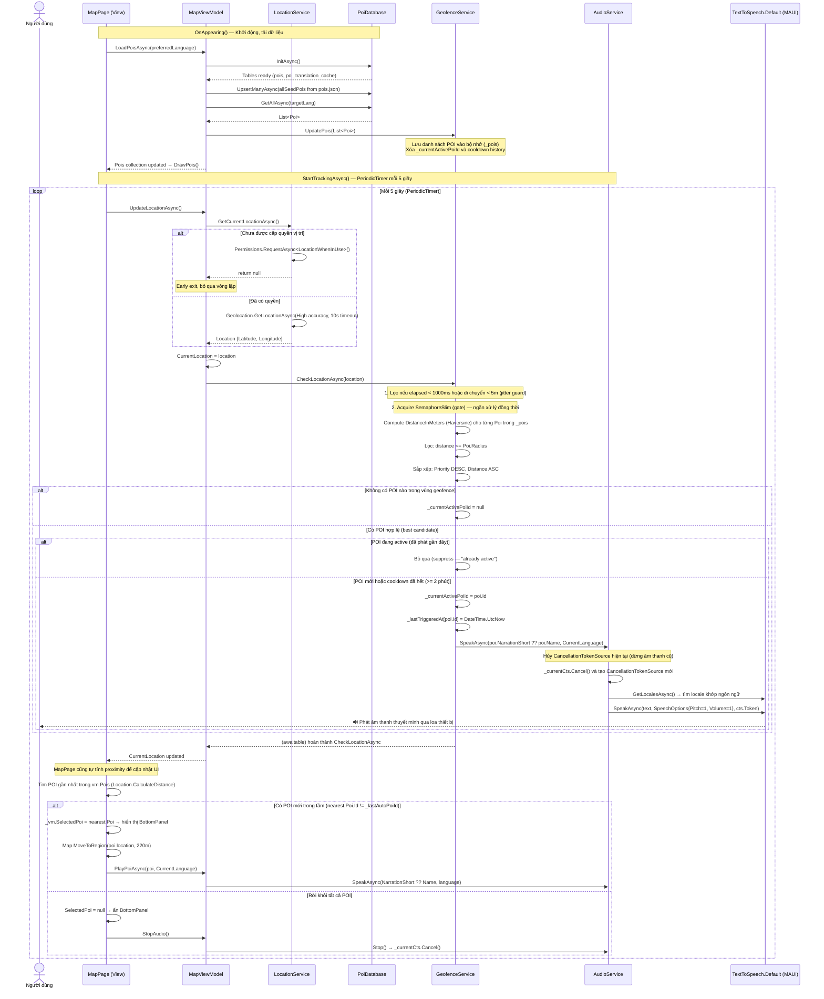

# Sequence Diagram — GPS Location Tracking to Audio Narration

## Giải thích kiến trúc

Luồng hệ thống bắt đầu bằng **`MapPage.OnAppearing()`**: trang gọi `MapViewModel.LoadPoisAsync()` để tải toàn bộ danh sách điểm đến (POI) từ file `pois.json`, upsert vào SQLite, sau đó nạp danh sách vào bộ nhớ của `GeofenceService` thông qua `UpdatePois()`. Đây là bước then chốt — `GeofenceService` **không tự truy vấn DB** mà hoạt động hoàn toàn trên bộ nhớ đệm in-memory.

Vòng lặp theo dõi vị trí được khởi động bởi một **`PeriodicTimer` (5 giây)** trong `MapPage`, không phải `DispatcherTimer`. Mỗi tick, `MapPage` gọi `MapViewModel.UpdateLocationAsync()` → `LocationService.GetCurrentLocationAsync()`. `LocationService` kiểm tra quyền GPS inline trong cùng phương thức này (không có `CheckPermissionAsync()` riêng biệt) và gọi `Geolocation.GetLocationAsync()` với độ chính xác cao, timeout 10 giây.

Sau khi có tọa độ, hệ thống xử lý **song song ở hai tầng**:
1. **`GeofenceService`** — bảo vệ chống nhiễu GPS (jitter guard: di chuyển < 5m hoặc interval < 1000ms bị bỏ qua), dùng thuật toán **Haversine** để đo khoảng cách, lọc theo `Radius`, sắp xếp theo `Priority`, và áp dụng **cooldown 2 phút** mỗi POI để tránh phát lại liên tục.
2. **`MapPage`** — tự tính proximity để cập nhật UI (BottomPanel, map center, pin selection).

`AudioService` triển khai cơ chế **preemptive cancellation**: mỗi lần `SpeakAsync()` được gọi, token hiện tại bị hủy ngay lập tức trước khi bắt đầu phát âm mới, đảm bảo không bao giờ có hai luồng TTS song song. Toàn bộ pipeline sử dụng `async/await` và được đăng ký dưới dạng **Singleton** trong DI container của MAUI.
