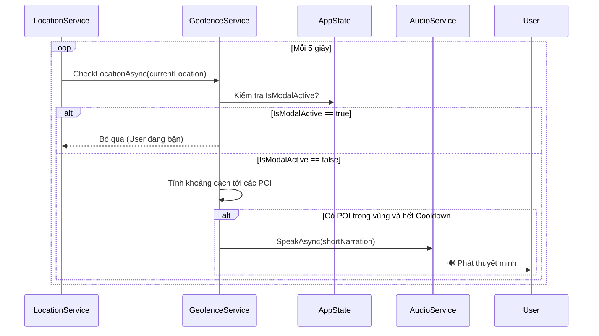
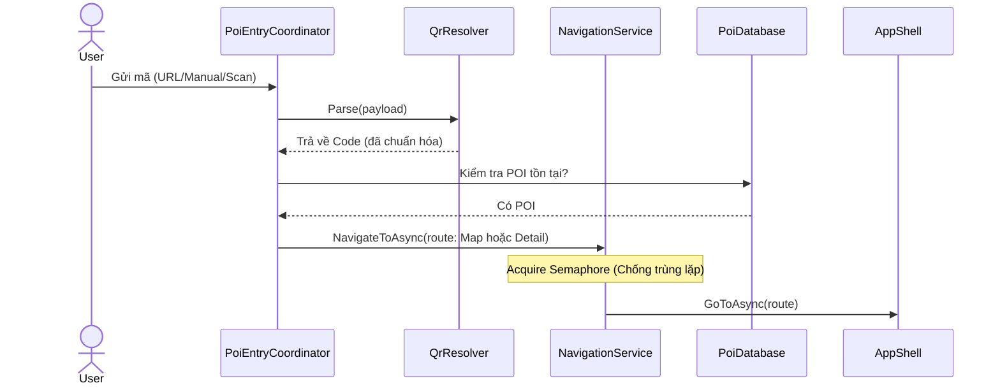
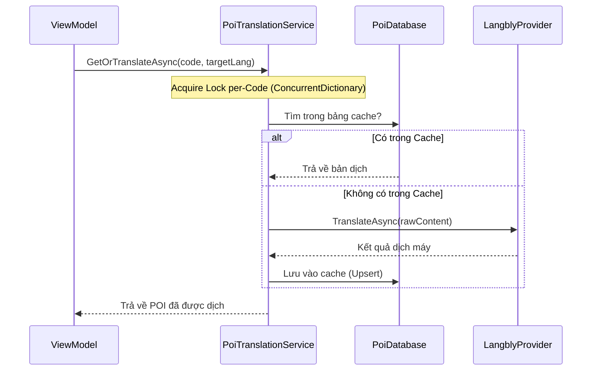

# Sequence Diagram — Các luồng nghiệp vụ chính VN-GO Travel (Cập nhật)

Tài liệu này mô tả các luồng xử lý quan trọng nhất trong ứng dụng: Theo dõi GPS, Nhập liệu POI (QR/Link) và Dịch thuật.

## 1. Luồng theo dõi vị trí GPS & Trigger âm thanh

Hệ thống sử dụng một vòng lặp kiểm tra mỗi 5 giây, có sự phối hợp với `AppState` để tránh làm phiền người dùng khi đang mở modal.

---

## 2. Luồng nhập liệu POI (QR / Deep Link / Manual)

Tất cả các con đường đều dùng chung một hành lang điều phối để đảm bảo tính ổn định.

---

## 3. Luồng dịch thuật nội dung POI

Khi chuyển sang ngôn ngữ chưa có sẵn, hệ thống sẽ ưu tiên lấy từ Cache trước khi gọi API.

