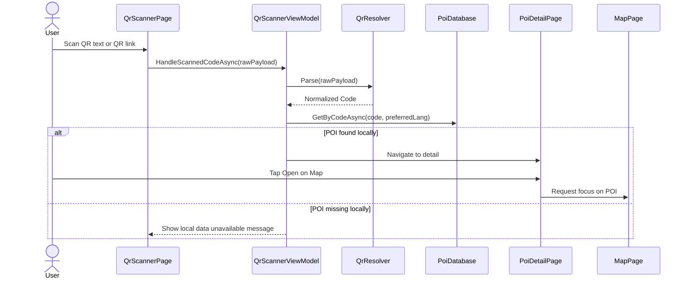

# QR Sequence — Target State

> **Runtime contract (frozen):** `docs/QR_MODULE.md` — các URL `your-domain` bên dưới là ví dụ lịch sử.

Tài liệu này mô tả flow QR mục tiêu sau khi mở rộng để dùng được cả trong app lẫn ngoài app.

## Design Principle
- QR public dùng URL
- app vẫn dùng lõi `Code -> POI`
- scanner trong app và deep link ngoài app dùng chung parser/resolver

## Target formats
- `poi:CODE`
- `poi://CODE`
- `CODE`
- `https://your-domain/p/CODE`
- `https://your-domain/poi/CODE`

## Mermaid Sequence — In-app Scanner Target


## Mermaid Sequence — External Camera Target
```mermaid
sequenceDiagram
    actor User
    participant Camera as Device Camera
    participant Link as Public QR Link
    participant OS as Android/iOS Link Dispatcher
    participant App as App DeepLink Entry
    participant Resolver as Qr/Link Resolver
    participant DB as PoiDatabase
    participant Detail as PoiDetailPage
    participant Web as Landing Page

    User->>Camera: Scan public QR
    Camera->>Link: Open https://your-domain/p/CODE
    Link->>OS: Resolve app link / universal link

    alt app installed and app link works
        OS->>App: Launch app with URL
        App->>Resolver: Extract Code from URL
        Resolver-->>App: Normalized Code
        App->>DB: GetByCodeAsync(code)
        alt POI found locally
            App->>Detail: Open POI detail
        else local data missing
            App-->>User: Show message / fallback
        end
    else app not installed or link fallback
        OS->>Web: Open landing page
        Web-->>User: Show POI teaser + install/open app CTA
    end
```

## Implementation Direction
1. ổn định current in-app flow
2. mở rộng parser cho URL
3. thêm deep link entry point
4. thêm external fallback page
