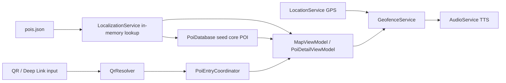

# Kiến trúc hiện tại (MVP)

## Mục tiêu tài liệu

Mô tả kiến trúc **đang chạy thật** trong app MAUI hiện tại. Không mô tả kiến trúc tương lai.

## 1) Thành phần chính

- `Views/*`: giao diện (Map, QR, Detail, Explore, About, chọn ngôn ngữ).
- `ViewModels/*`: điều phối dữ liệu UI theo MVVM.
- `Services/*`: xử lý dữ liệu, GPS, geofence, âm thanh, QR, điều hướng.
- `Models/*`: model POI, localization, kết quả parse QR, deep link.
- `Resources/Raw/pois.json`: dữ liệu nội dung POI gốc.

## 2) Vai trò service quan trọng

- `PoiDatabase`
  - Lưu SQLite local ở `FileSystem.AppDataDirectory/pois.db`.
  - Lưu dữ liệu lõi POI (tọa độ, radius, priority, code).
  - Có bảng cache dịch `PoiTranslationCacheEntry`.

- `LocalizationService`
  - Nạp một lần từ `pois.json` vào dictionary in-memory.
  - Trả về text theo ngôn ngữ + trạng thái fallback.
  - Cấp dữ liệu lõi để seed DB lần đầu.

- `MapViewModel`
  - Trung tâm cho màn map.
  - Load POI từ DB, hydrate text theo ngôn ngữ, cập nhật pin.
  - Điều phối phát audio ngắn/dài và đổi ngôn ngữ runtime.

- `LocationService` + `GeofenceService`
  - `LocationService`: xin quyền vị trí + lấy GPS hiện tại.
  - `GeofenceService`: kiểm tra vào/ra vùng POI và trigger TTS.

- `AudioService`
  - Bọc `TextToSpeech`.
  - Có serialize call, debounce, chọn locale theo mã ngôn ngữ.

- `QrResolver` + `PoiEntryCoordinator`
  - Parse input QR (`poi:CODE`, `poi://CODE`, URL `/poi/{CODE}`, `/p/{CODE}`).
  - Kiểm tra POI tồn tại trong DB, sau đó điều hướng map/detail.

- `DeepLinkCoordinator` + `DeepLinkHandler`
  - Nhận link từ Android intent (warm path), đợi shell sẵn sàng, rồi đẩy vào cùng pipeline điều hướng với QR.

## 3) Sơ đồ tổng quát (đúng hiện trạng)

## 4) Ranh giới kiến trúc hiện tại

- Không có backend đồng bộ dữ liệu cho app MAUI.
- `AdminWeb` là dự án riêng, không thuộc luồng runtime của app MAUI hiện tại.
- Ưu tiên chạy ổn định local-first, chấp nhận một số giới hạn về đồng bộ nội dung và test tự động.
