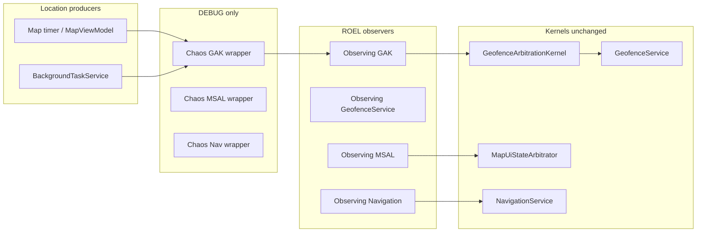

# VN-GO-Travel — Architecture reconciliation & baseline audit (pre–7.3)

**Document type:** Single authoritative reconciliation (code + layered docs).  
**Scope:** MAUI runtime, 7.2.x authority stack, adjacent backend/admin surfaces **as they exist today**.  
**Explicit non-scope:** No 7.3+ product design, no new features, no implementation tasks.

**Sources of truth for this audit:** `Services/*` (GAK, MSAL, RDGL, ROEL, PCSL), `MauiProgram.cs`, `App.xaml.cs`, `AppState.cs`, `ViewModels/MapViewModel.cs`, `Views/MapPage.xaml.cs`, `Services/BackgroundTaskService.cs`, `Services/PoiEntryCoordinator.cs`, `ContractDefinition/Core/EventContractV1.cs`, `docs/*` layer specs, `docs/SYSTEM_CURRENT_STATE.md`.

---

## 1. Architecture map (current state)

### 1.1 Runtime subsystems (7.2 stack)

| Layer | ID | Primary artifacts | Role |
|-------|----|--------------------|------|
| Geofence Arbitration Kernel | **GAK (7.2.3)** | `IGeofenceArbitrationKernel`, `GeofenceArbitrationKernel` | Single ingress for GPS samples that commit **`AppState.CurrentLocation`** (main thread) and drive **`IGeofenceService.CheckLocationAsync`** with optional **coalescing** of duplicate/near-duplicate ticks. |
| Map UI State Arbitrator | **MSAL (7.2.4)** | `IMapUiStateArbitrator`, `MapUiStateArbitrator` | Single commit path for map **`SelectedPoi`** via **`AppState.CommitSelectedPoiForUi`**, with source tagging and main-thread serialization. |
| Runtime Determinism Guard | **RDGL (7.2.5)** | `RuntimeDeterminismGuard` | **DEBUG:** logs when **`CurrentLocation`** / **`SelectedPoi`** change off the UI thread. **Release:** no-op constructor. CI grep rules (per governance docs) reinforce write boundaries. |
| Runtime Observability + Efficiency | **ROEL (7.2.6)** | `ObservingGeofenceArbitrationKernel`, `ObservingGeofenceService`, `ObservingMapUiStateArbitrator`, `ObservingNavigationService`, `RuntimeTelemetryService`, `BatteryEfficiencyMonitor`, `RuntimeReplayEngine` (DEBUG) | **Non-blocking** bounded-channel telemetry + ring buffer + optional DEBUG NDJSON; **no** change to kernel decisions. |
| Production Chaos Simulation | **PCSL (7.2.7)** | `ChaosGeofenceArbitrationKernel`, `ChaosMapUiStateArbitrator`, `ChaosNavigationService`, `ChaosSimulationService`, `ChaosValidationEngine` (DEBUG) | **DEBUG-only** outer decorators (see `#if DEBUG` in `MauiProgram.cs`); **Release** resolves **ROEL observers only** (no chaos types in the graph). |
| Production certification / governance | **PCGL (7.2.8)** | `ProductionReadinessEvaluator`, governance docs | Deterministic **go/no-go** from **explicit inputs**; does not alter runtime behavior until something supplies those inputs. |

### 1.2 Write vs read authority (concise)

| Concern | Authoritative writer (intended) | Typical readers |
|---------|----------------------------------|-----------------|
| `AppState.CurrentLocation` | **GAK** (`GeofenceArbitrationKernel.PublishLocationAsync` → main-thread assign) | Map UI binding (`MapViewModel.CurrentLocation`), `GeofenceService`, map drawing (`MapPage`), ROEL observers. |
| `AppState.SelectedPoi` (map selection) | **MSAL** (`MapUiStateArbitrator` → `CommitSelectedPoiForUi`) | Map/detail VMs, `GeofenceService` (read), narration/focus services via MSAL apply APIs. |
| Geofence evaluation | **`GeofenceService.CheckLocationAsync`** | Invoked from **GAK only** (after publish path). |
| Shell / route transitions | **`INavigationService`** (`NavigationService` + ROEL/PCSL decorators in DEBUG) | Pages, coordinator, deep links. |
| Runtime execution trace (7.2.6) | **ROEL** producers (decorators) | `RuntimeTelemetryService` consumer, DEBUG replay export. |
| Translation / product analytics events | **`IEventTracker`** / `QueuedEventTracker` → `IEventBatchSink` | **Separate** from ROEL; today wired to **`LoggingTranslationEventBatchSink`** in `MauiProgram` (log-oriented sink, not ROEL ring buffer). |

### 1.3 Data flows (as implemented)

**GPS / location**

1. **Foreground map loop:** `MapPage.StartTrackingAsync` → `MapViewModel.UpdateLocationAsync` → `ILocationProvider` → **`IGeofenceArbitrationKernel.PublishLocationAsync(..., "map", ...)`**.  
2. **Background loop:** `BackgroundTaskService.RunLocationLoopAsync` (5s delay) → same provider → **`PublishLocationAsync(..., "background", ...)`**.  
3. **GAK** updates `CurrentLocation` on the **main thread**, then may invoke **`CheckLocationAsync`** (subject to coalescing rules).

**UI selection**

- All audited call sites use **`IMapUiStateArbitrator.ApplySelectedPoiAsync`** / **`ApplySelectedPoiByCodeAsync`** (`MapPage`, `MapViewModel`, `PoiFocusService`, `PoiNarrationService`, `LanguageSwitchService`, `PoiDetailViewModel`, `PoiEntryCoordinator`).

**Navigation**

- `PoiEntryCoordinator` holds **`INavigationService`** and **`IMapUiStateArbitrator`**; QR/deep-link entry applies **MSAL** then navigates via the navigation abstraction (ROEL wraps; PCSL may wrap in DEBUG only).

**Telemetry**

- **ROEL:** decorators → `IRuntimeTelemetry.TryEnqueue` → `RuntimeTelemetryService` (bounded channel + ring).  
- **Product/translation contract path:** `TranslationEvent` / `IEventTracker` / optional contract replay hooks — **orthogonal** schema to `RuntimeTelemetryEvent`.

**Chaos (DEBUG only)**

- PCSL decorators sit **outside** ROEL observers in DEBUG (`MauiProgram.cs`); Release registrations skip chaos types entirely.

### 1.4 Optional diagram (logical)

---

## 2. Source of truth matrix

| Datum | Canonical store | Who may **write** | Who **reads** | Notes |
|-------|------------------|-------------------|---------------|--------|
| **CurrentLocation** | `AppState.CurrentLocation` | **GAK** only in current codebase (`GeofenceArbitrationKernel`) | Map VM, map view, `GeofenceService`, ROEL | Prior design docs described extra writers; **reconciliation:** `CurrentLocation =` appears **only** in `GeofenceArbitrationKernel.cs`. |
| **SelectedPoi** (map) | `AppState.SelectedPoi` | **`CommitSelectedPoiForUi`** only; reachable only via **MSAL** | Bindings, geofence (read), narration/focus | Property setter is **private** on `AppState`; external code must use **`IMapUiStateArbitrator`**. |
| **Navigation state** | Shell + page stack; `AppState.ModalCount` for modal mirror | **`INavigationService`** (and MAUI Shell internally) | All pages | ROEL observes; PCSL may stress in DEBUG. |
| **ROEL telemetry stream** | `RuntimeTelemetryService` in-process | ROEL decorators / battery monitor | DEBUG replay, chaos validator, manual diagnostics | **Not** durable by default; **not** the same as Mongo analytics. |
| **Translation / analytics events** | Buffered `TranslationEvent` list + optional contract telemetry | `IEventTracker.Track` callers | `LoggingTranslationEventBatchSink` (current default) | Uses **generated contract** shapes aligned with `EventContractV1` for wire/replay tooling; **sink choice** determines whether events reach a remote store (today: logging sink). |

---

## 3. Cross-layer dependencies, coupling, and risks

### 3.1 Hidden or read-side coupling (allowed but fragile)

- **`AppState.Pois`** is a shared **`ObservableCollection<Poi>`** mutated by hydration, language refresh, translation paths, and read concurrently from **background** map proximity logic (snapshots mitigate but do not remove all contention classes). This is **outside** GAK/MSAL’s narrow surfaces but **inside** the geofence/narration critical path.  
- **`GeofenceService`** reads **`SelectedPoi`**, language, modal flags — **correct** for policy, but creates **semantic coupling** between geofence audio and whatever MSAL last committed.  
- **Localization / translation** dictionaries (`LocalizationService`) are read on hot paths; write patterns are lock-governed in places but remain a **consistency** surface for future intelligence layers.

### 3.2 Accidental write paths (reconciliation verdict)

- **`CurrentLocation`:** **No** alternate writers found in `.cs` grep vs. **GAK** — **aligned** with governance.  
- **`SelectedPoi`:** **No** direct assignment outside `AppState` internal commit — **callers use MSAL** — **aligned**.  
- **Residual product-risk paths (not “AppState bypass” but dual behavior):**  
  - **Proximity auto-narration** in `MapPage` (`PlayPoiAsync`) can overlap **geofence-triggered** audio in `GeofenceService` — documented in `prd/` sequences as **two narration drivers** (not two GPS writers). This is **behavioral coupling**, not a second `CurrentLocation` writer.

### 3.3 Duplicated logic / parallel decision channels

- **Distance / candidate ordering** appears in **`GeofenceService`** (geofence policy) and **`MapPage`** proximity block (UI auto-select + panel) — **two consumers** of similar geo math with **different** responsibilities; risk is **duplicate triggers** (audio/UI), not duplicate location truth.  
- **Premium / entitlement** checks have historically been described as **split** across use cases vs UI (`docs/system_flow_audit.md`); any 7.3 work must **not** assume a single gate without re-audit.

---

## 4. ROEL ↔ “business intelligence” gap analysis

### 4.1 What ROEL **is**

- A **runtime diagnostic graph**: kinds such as GPS tick, location publish complete, geofence evaluated, MSAL apply/commit, navigation executed, performance anomalies, etc.  
- **`RuntimeTelemetryEvent`** carries **kind, ticks, producer id, optional lat/lon, poi code, route/detail strings** — **not** a full product analytics envelope.

### 4.2 What ROEL **is not**

- **Not** a user analytics warehouse, **not** identity lifecycle management, **not** cross-device session analytics, **not** admin KPI aggregation.  
- **Not** a substitute for **durable ingestion**, **PII policy**, or **server-side correlation** across platforms.

### 4.3 What a future **user / business intelligence** layer would still need

Already partially present in **contract** space (`EventContractV1`: `userId`, `deviceId`, `sessionId`, `actionType`, geo fields, etc.) **but** not equivalent to ROEL:

| Capability | Current baseline | Gap |
|------------|------------------|-----|
| **User tracking** | `TranslationEvent` + `IEventTracker`; `App` resolves `IDeviceIdProvider` early | **No** mandatory unified **client → server** pipeline in default DI (`LoggingTranslationEventBatchSink`); **no** ROEL merge with product events. |
| **Identity system** | `AuthService` + JWT for **API-backed** flows | ROEL events **do not** embed `authState`; contract events can carry `userId` **if** producers populate them consistently. |
| **Cross-platform event system** | Contract generator + replay tooling (`ContractObservability`) | **Mobile + web + admin** need a **single agreed sink** (HTTP batch, queue, etc.), **retry**, and **schema versioning** beyond local buffers. |
| **Persistence** | Backend **MongoDB** for admin/POI workflows per `docs/SYSTEM_CURRENT_STATE.md` | **No** requirement that MAUI ROEL or translation buffer lands in Mongo **by default**; explicit **ingestion API** + indexes + TTL policies would be new work. |
| **Aggregation / admin-web** | `admin-web/` moderation + audits | **Not** integrated with ROEL or runtime replay; analytics dashboards (if any) are **out of scope** of 7.2.x. |

**Conservative conclusion:** **ROEL proves runtime health;** **EventContract / `IEventTracker` prove intent toward product telemetry;** neither alone constitutes a shipped **business intelligence platform**.

---

## 5. Runtime guarantee check (honest status)

| Guarantee | Evidence today | Status |
|-----------|----------------|--------|
| **Deterministic geofence execution** (single ingress, coalescing) | `GeofenceArbitrationKernel` + single `CheckLocationAsync` caller chain | **Strong for location ingress and evaluation scheduling** — coalescing can **drop** redundant evaluations by design. |
| **Single-source UI selection authority** | Private `SelectedPoi` setter; only `CommitSelectedPoiForUi` via MSAL; grep on `ApplySelectedPoi*` | **Met for `SelectedPoi` writes**. |
| **No cross-thread `CurrentLocation` / `SelectedPoi` violations** | GAK marshals location to main thread; MSAL applies on main thread; **RDGL** warns in DEBUG only | **Partial:** **DEBUG** observability only; **Release** does not auto-detect violations. |
| **No dual uncorrelated GPS → `AppState` write loops** | Both map and background call **`PublishLocationAsync`** only | **Met** for **`CurrentLocation`** (reconciled against code). |
| **No dual narration / duplicate trigger risk** | Map proximity + `GeofenceService` audio | **Not fully guaranteed** — **separate product-level** issue from GAK location truth. |

---

## 6. Safe extension boundary for 7.3+ (strict contract)

**Purpose:** Define where future **business / user intelligence** may attach **without** breaking 7.2 runtime determinism contracts.

### 6.1 **MAY reuse** (read or subscribe, non-authoritative)

- **ROEL** snapshots / DEBUG replay exports for **SRE-style** correlation (read-only tooling).  
- **GAK-published facts** indirectly: consume **`AppState.CurrentLocation`** and geofence outcomes **after** they occur — **never** inject alternate location writers.  
- **`IEventTracker` / `TranslationEvent`** pipeline for **product events**, provided **batch sinks** remain **async, bounded, and failure-isolated** from GAK/MSAL hot paths.  
- **Backend APIs** already used for auth / POI sync (see `SYSTEM_CURRENT_STATE`) — **extend via new endpoints**, not by editing kernels.

### 6.2 **MUST NOT touch** (without a new architecture RFC + parity tests)

- **`GeofenceArbitrationKernel`** coalescing / publish semantics.  
- **`MapUiStateArbitrator`** arbitration ordering, dedupe, and commit rules.  
- **`GeofenceService`** distance/cooldown/gate **policy** (unless explicitly chartered as a product change with full regression).  
- **PCSL** registration in Release builds (**forbidden**).  
- **Replacing ROEL** with blocking I/O or synchronous network calls on decorated paths.

### 6.3 **Where 7.3 should attach** (recommended loci)

1. **New service(s)** registered in DI **after** existing singletons, taking dependencies on **`IEventTracker`**, **`ApiService`**, **`IUserContextSnapshotProvider`**, **`AuthService`**, **not** on raw `AppState` for location/selection mutation.  
2. **Event sinks:** implement **`IEventBatchSink`** (or a parallel **outbox** abstraction) that posts to backend **out of band** of UI thread — **do not** send from inside `RuntimeTelemetryService` consumer in a blocking way.  
3. **Admin / analytics:** consume **server-stored** events only; **never** assume ROEL ring buffer visibility from web.

### 6.4 RBEL client bridge (**7.3.1**, MAUI — implemented)

The app includes an **additive** client bridge (**no** changes to **GAK**, **MSAL**, **NavigationService**, **GeofenceService**, or **ROEL decorator** code paths) that:

- Polls **`IRuntimeTelemetry.GetRecentSnapshot`** from a **background** loop (not the UI thread).
- Maps ROEL **`RuntimeTelemetryEventKind`** values to **EventContractV2-oriented** wire events and posts batches to the **7.3.0** endpoint **`POST /api/v1/intelligence/events/batch`**.

Authoritative implementation + retry/queue policy + identity rules: **[bridge/rbel_client_bridge_v7_3_1.md](bridge/rbel_client_bridge_v7_3_1.md)**.

---

## 7. DO NOT TOUCH LIST (critical safety)

1. **Never** assign **`AppState.CurrentLocation`** outside **`GeofenceArbitrationKernel`** (the only writer in the reconciled codebase).  
2. **Never** commit **`AppState.SelectedPoi`** except through **`MapUiStateArbitrator`** → **`CommitSelectedPoiForUi`**.  
3. **Never** call **`IGeofenceService.CheckLocationAsync`** except from the **GAK publish pipeline** (keeps a single evaluation authority).  
4. **Never** mutate core **`AppState`** location/selection fields from ad-hoc background tasks without going through **GAK/MSAL**.  
5. **Never** disable **RDGL-related CI checks** or thread contracts without governance sign-off.  
6. **Never** register **PCSL** chaos for production or store Release graphs.  
7. **Never** make **ROEL** producers await network I/O or heavy work — keep **TryEnqueue** semantics non-blocking.  
8. **Never** conflate **ROEL** internal events with **privacy/compliance-approved** product analytics — treat separate schemas and retention policies.

---

## 8. Sign-off block (baseline only)

| Item | Owner | Date |
|------|-------|------|
| Reconciliation reviewed | _TBD_ | _TBD_ |
| Next step: 7.3 intelligence RFC | _TBD_ | _TBD_ |

**Statement:** This document is a **baseline audit** as of repository state at authoring time. It **does not** certify production readiness; see **`docs/production_certification_report_v7_2_8.md`** and **PCGL** inputs for that process.

**Successor bridge (design-only):** [bridge/runtime_to_business_event_bridge_layer_rbel_spec.md](bridge/runtime_to_business_event_bridge_layer_rbel_spec.md) — RBEL (stack **7.2.9**), EventContractV2 and 7.3 ingestion contract **without** changing 7.2 runtime behavior.

**Client activation (implemented):** [bridge/rbel_client_bridge_v7_3_1.md](bridge/rbel_client_bridge_v7_3_1.md) — **7.3.1** MAUI bridge; **additive observability only** (same non-touch rules as §6.4).
