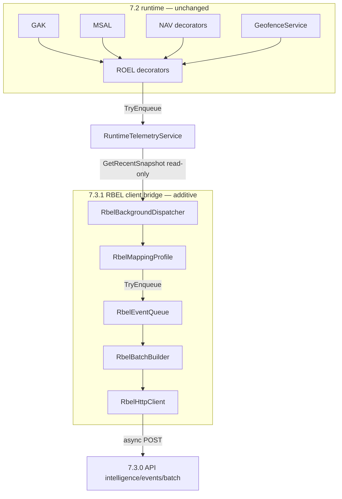

# RBEL client bridge (7.3.1) — production monitoring activation (MAUI)

**Status:** Implemented in the MAUI app as an **additive observability layer**.  
**Scope:** Client-only pipeline from **ROEL read surfaces** → bounded queue → batch → **`POST /api/v1/intelligence/events/batch`** (7.3.0 backend).  
**Non-scope:** **No** changes to **GeofenceArbitrationKernel (GAK)**, **MapUiStateArbitrator (MSAL)**, **NavigationService**, **GeofenceService**, or **ROEL decorator** implementations, timing, or semantics.

**Related:** [runtime_to_business_event_bridge_layer_rbel_spec.md](runtime_to_business_event_bridge_layer_rbel_spec.md) (RBEL design) · [../intelligence/user_intelligence_system_v7_3_0_spec.md](../intelligence/user_intelligence_system_v7_3_0_spec.md) (7.3.0 ingestion) · [../SYSTEM_CURRENT_STATE.md](../SYSTEM_CURRENT_STATE.md) · [../architecture_v7_2_system_reconciliation_baseline.md](../architecture_v7_2_system_reconciliation_baseline.md)

---

## Safety statement

This layer is **strictly passive**:

- It **observes** ROEL’s existing ring-buffer snapshot API (`IRuntimeTelemetry.GetRecentSnapshot`) from a **background task** (`Task.Run` + `PeriodicTimer`).
- It **does not** subscribe inside GAK/MSAL/NAV hot paths, **does not** mutate `AppState`, and **does not** await network I/O on the UI thread.
- **Kernel logic, geofence decisions, map selection arbitration, navigation behavior, and map tracking cadence are unchanged.**

---

## Architecture (logical)

---

## Pipeline stages

| Stage | Component | Behavior |
|-------|-----------|----------|
| 1 — Tick | `RbelBackgroundDispatcher` | Every **~1.5 s** on a **pool thread** (`PeriodicTimer`); skipped when `RbelBridgeConfiguration.IsEnabled` is false. |
| 2 — ROEL tap | Same | Calls `GetRecentSnapshot(512)`; **first tick** sets watermark to latest `UtcTicks` and returns (**no replay** of historical ring on cold start). |
| 3 — Map | `RbelMappingProfile.TryMapFromRoel` | Maps each **new** `RuntimeTelemetryEvent` (by watermark) to `RbelWireEvent` or **null** (drop noise). |
| 4 — Enqueue | `RbelEventQueue.TryEnqueue` | Bounded `Channel` (**2000** slots), `TryWrite` only, `DropWrite` on full. |
| 5 — Drain + batch | `RbelBatchBuilder` | Drain up to **512** per inner loop; flush batch when **≥ 100** events **or** **≥ 2 s** since first event in current batch. |
| 6 — Send | `RbelHttpClient.PostBatchAsync` | Async `HttpClient.SendAsync`; **Bearer** JWT if present, else **`X-Api-Key`** from `RbelBridgeConfiguration.IntelligenceIngestApiKey`. If **both** missing, **no request** (silent). |

---

## Event mapping (ROEL kind → RBEL / 7.3.0)

Runtime signals are **already** classified by ROEL decorators. The bridge maps **kinds** to **`rbelEventFamily`** + **`sourceSystem`** (EventContractV2-oriented payload in `payload` including `roelKind`, `producerId`, `detail`, `routeOrAction`, `poiCode`, optional lat/lon).

| ROEL `RuntimeTelemetryEventKind` | Conceptual RBEL / product event | `rbelEventFamily` | `sourceSystem` |
|----------------------------------|----------------------------------|-------------------|----------------|
| `LocationPublishCompleted` | Location / GAK publish completion | `location` | `GAK` |
| `GeofenceEvaluated` | Geofence evaluation (observed outcome) | `location` | `GAK` |
| `UiStateCommitted` | Map UI selection commit (`SelectedPoi`) | `user_interaction` | `MSAL` |
| `NavigationExecuted` | Shell / route navigation | `navigation` | `NAV` |
| `PotentialDuplicateGpsObserved` | Duplicate / near-duplicate GPS (ROEL anomaly) | `observability` | `ROEL` |
| `TelemetryDropped` | ROEL internal pressure | `observability` | `ROEL` |
| `PerformanceAnomaly` | ROEL performance / bridge pressure | `observability` | `ROEL` |
| `MsalApplyInvoked` | MSAL apply invoked (diagnostic; not a UI commit) | `observability` | `MSAL` |
| `GpsTickReceived` | High-volume raw tick | **Not forwarded** | — |
| Other / unknown kinds | — | **Not forwarded** | — |

**Ordering:** Each mapped event gets a monotonic **`runtimeSequence`** (`RbelRuntimeSequenceSource`). **`correlationId`** is stable per `RbelCorrelationScope` and **rotates after** mapping a `NavigationExecuted` event (`OnNavigationEvent`), aligning client-side “journey” boundaries with navigation without touching `NavigationService` internals.

---

## Identity enrichment (per wire event)

| Field | Rule |
|-------|------|
| `deviceId` | Required from `IUserContextSnapshotProvider` / `UserContext`; if empty, **no events** are produced for that tick. |
| `userId` | Nullable; from authenticated profile when present. |
| `authState` | `guest` \| `logged_in` \| `premium` (from `EventUserTier`). |
| `userType` | Parallel wire enum: `guest` \| `user` \| `premium`. |
| `correlationId` | Required; client-generated GUID string; **rotates on navigation** (see above). |
| `sessionId` | From `TranslationTrackingSession.SessionId` (stable for analytics session stitching). |
| `runtimeTickUtcTicks` | ROEL event `UtcTicks` (original observation time). |
| `sourceSystem` | `GAK` \| `MSAL` \| `NAV` \| `ROEL` per mapping table. |
| `rbelMappingVersion` | Constant **`rbel-1.0.1`** (must stay aligned with batch envelope `rbelMappingVersion` in `RbelHttpClient`). |

**Guest → login:** **`deviceId`** persists via the app’s device id provider; **backend 7.3.0** merges profiles — the client **does not** implement merge logic.

---

## Retry, drop, and overflow policy

| Situation | Policy |
|-----------|--------|
| RBEL queue full (`TryWrite` fails) | **Drop** the outbound RBEL event; emit **one** ROEL `PerformanceAnomaly` (`detail: rbel_queue_full`, `producerId: rbel`) — **no** blocking, **no** throw into producer path. |
| HTTP 5xx, 408, 429, or network error | **Up to 3 attempts** with exponential backoff (base **400 ms**, cap **5 s** between attempts). |
| HTTP 4xx (other than 408/429) | **No retry**; batch discarded for that attempt (best-effort). |
| Missing JWT and missing `IntelligenceIngestApiKey` | **No HTTP**; events may accumulate in queue until memory pressure; operators should set key or login for ingest. |
| Dispatcher tick exception | Logged at **Debug** only; loop continues. |

**Note:** Failed batches after retries are **silent** from a UX perspective (no toasts, no blocking). Optional future work: a **rate-limited** ROEL marker for sustained HTTP failure (avoid feedback loops).

---

## Failure modes

| Failure | User-visible impact | Runtime impact |
|---------|---------------------|----------------|
| Backend down | None | Batches fail after retries; no kernel changes. |
| Wrong / missing API key | None | 401/403; no retry for most 4xx; events not stored. |
| Saturated RBEL queue | None | Events dropped; ROEL anomaly for visibility. |
| `IsEnabled == false` | None | Dispatcher no-ops (still ticks lightly). |

---

## Backend compatibility (7.3.0)

- **Endpoint:** Relative to MAUI `HttpClient.BaseAddress` (same as `BackendApiConfiguration` **`.../api/v1/`**): **`intelligence/events/batch`** → full URL **`/api/v1/intelligence/events/batch`**.
- **Envelope:** JSON with `schema: "event-contract-v2"`, `rbelMappingVersion`, `sentAt`, and `events[]` matching **`RbelWireEvent`** (`contractVersion`, `eventId`, identity fields, `payload`, etc.).
- **Auth:** Matches server expectations: **`Authorization: Bearer`** for logged-in users, or **`X-Api-Key`** when **`INTELLIGENCE_INGEST_API_KEY`** is set on the server and the same value is configured in **`RbelBridgeConfiguration.IntelligenceIngestApiKey`** for guests/devices.
- **Regression:** Jest integration tests in `backend/tests/backend.integration.test.js` (suite **7.3.0 — Intelligence ingestion**) validate batch auth, dedupe keys (`device_id` + `correlation_id` + `runtime_sequence`), and admin journey reads.

---

## Code map (MAUI)

| Artifact | Path |
|----------|------|
| Feature flag + API key | `Configuration/RbelBridgeConfiguration.cs` |
| Queue / batch / HTTP / dispatcher / mapping | `Services/RBEL/*.cs` |
| DI registration | `MauiProgram.cs` |
| Non-blocking start | `App.xaml.cs` (`Task.Run` → `RbelBackgroundDispatcher.Start`) |

---

## Configuration checklist

1. Set **`RbelBridgeConfiguration.IntelligenceIngestApiKey`** at startup (or via future centralized config) to match server **`INTELLIGENCE_INGEST_API_KEY`** for **guest** ingestion **or** rely on **JWT** after login.
2. Leave **`RbelBridgeConfiguration.IsEnabled`** `true` for production monitoring; set `false` only to disable the bridge entirely.
