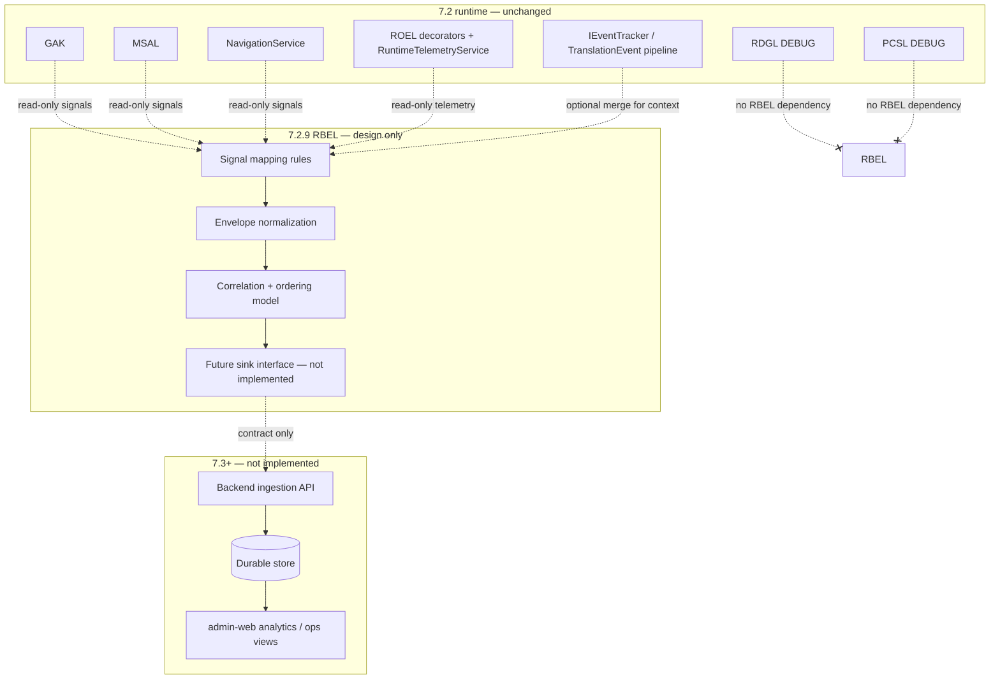

# Runtime-to-Business Event Bridge Layer (RBEL) — specification

**Status:** Design-only. **No implementation**, no persistence, no backend code in this deliverable.  
**Depends on:** [architecture_v7_2_system_reconciliation_baseline.md](../architecture_v7_2_system_reconciliation_baseline.md), `ContractDefinition/Core/EventContractV1.cs`, ROEL/GAK/MSAL governance docs.

### Stack numbering note

This repository already assigns **7.2.8** to **PCGL** (production certification + governance). RBEL is the **transitional bridge to 7.3** and is positioned here as **7.2.9 RBEL** so governance, certification, and bridge specs stay unambiguous. If product governance chooses to renumber, update indexes only—do not merge RBEL responsibilities into PCGL.

---

## 1. Architecture (runtime → RBEL → future 7.3)

RBEL is a **logical transformation layer**: it defines **how** runtime-side signals become **normalized business-oriented envelopes** suitable for a future ingestion API. It does **not** register in DI, does **not** wrap GAK/MSAL/ROEL, and does **not** run on hot paths in this phase.



**Directionality:** Arrows into RBEL are **conceptual read-only observability** (snapshots, callbacks, or future adapters that **never** call back into GAK/MSAL). RBEL **never** writes `AppState`, **never** calls `PublishLocationAsync`, **never** calls `ApplySelectedPoiAsync`.

---

## 2. Consolidated event taxonomy (RBEL output types)

RBEL defines **four logical families** emitted after transformation (still **not** persisted in this layer).

| RBEL logical type | Purpose | Primary runtime inputs (non-authoritative) |
|-------------------|---------|---------------------------------------------|
| **LocationEvent** | Business-safe representation of **location lifecycle** and **geofence outcomes** | GAK path: location publish / coalesce outcome; `GeofenceEvaluated` (via ROEL-observed `IGeofenceService`); optional `GpsTickReceived` for ordering |
| **UserInteractionEvent** | **Selection and UI intent** without replacing MSAL | MSAL: apply invoked + committed selection; optional `MapUiSelectionSource` encoded as `source` detail |
| **NavigationEvent** | **Route / modal** transitions for journey reconstruction | `NavigationService` observations (ROEL `NavigationExecuted`); modal policy stays in NAV |
| **ObservabilityEvent** | **Health, drops, anomalies** — **not** a business source of truth | ROEL-only kinds (e.g. performance anomaly, duplicate GPS inference, channel drop signals if exposed) |

**Critical distinction:** **ObservabilityEvent** must **never** be used alone to infer revenue, compliance, or user intent. It exists for **SRE / determinism audits** correlated with the other three families via **correlationId**.

---

## 3. Event mapping table (runtime → RBEL envelope)

Mappings are **rules**, not code. Column “ROEL kind” refers to values in `RuntimeTelemetryEventKind` / ROEL docs where applicable.

| Runtime origin | Representative signal | RBEL output family | `sourceSystem` (wire) | Notes |
|----------------|-------------------------|--------------------|------------------------|--------|
| GAK | `PublishLocationAsync` accepted (location committed to UI thread) | **LocationEvent** | `GAK` | Include producer id (`map` / `background`), lat/lon, `UtcTicks` |
| GAK | Coalesced duplicate suppressed (no `CheckLocationAsync`) | **LocationEvent** (variant) | `GAK` | Mark as `coalescedSkip: true` in payload extension — **not** a geofence trigger |
| Geofence service | `GeofenceEvaluated` | **LocationEvent** | `GAK` | Geofence is downstream of GAK publish; still classified under **GAK** domain for business clarity |
| MSAL | `MsalApplyInvoked` / `UiStateCommitted` pair | **UserInteractionEvent** | `MSAL` | Carry `poiCode` when committed selection non-null |
| Navigation | `NavigationExecuted` | **NavigationEvent** | `NAV` | Route or action string from ROEL detail |
| ROEL | `PerformanceAnomaly`, duplicate GPS, drop/write warnings | **ObservabilityEvent** | `ROEL` | **Never** promoted to “user action” without MSAL/NAV/GAK corroboration |
| `IEventTracker` / translation | `TranslationEvent` (existing contract) | **Out of RBEL core** or **optional merge** | `TEV` (reserved) | RBEL may **reference** `eventId` / `sessionId` for correlation **without** changing `IEventTracker` |

---

## 4. EventContractV2 schema (extends V1 — specification only)

**Version key:** `contractVersion = "v2"`.  
**Compatibility:** V2 is a **superset** of V1 field semantics with **stricter** identity rules and **new** correlation dimensions. Implementations (future) must reject V2 batches missing **deviceId** or **correlationId**.

### 4.1 Carried forward from V1 (unchanged JSON names)

All V1 fields in `EventContractV1.Fields` remain valid on the wire for events that still need them: `eventId`, `requestId`, `sessionId`, `poiCode`, `language`, `userType`, `userId`, `status`, `durationMs`, `timestamp`, `source`, `actionType`, `networkType`, `userApproved`, `fetchTriggered`, `latitude`, `longitude`, `geoRadiusMeters`, `geoSource`, `batchItemCount`.

**V1 adjustments under V2 rules:**

| Field | V1 today | V2 rule |
|-------|----------|---------|
| `deviceId` | Nullable | **Required** on every V2 envelope |
| `userId` | Nullable | Remains **nullable** (guest-capable) |
| `userType` (`EventUserTier`) | Required enum | Remains; **must be consistent** with new `authState` (see mapping below) |

### 4.2 New V2-only fields

| JSON name | Type | Nullable | Description |
|-----------|------|----------|-------------|
| `contractVersion` | string | no | Fixed `"v2"` for RBEL-normalized events |
| `authState` | enum string | no | `guest` \| `logged_in` \| `premium` — **session-derived**, not a replacement for server-side auth proof |
| `sourceSystem` | enum string | no | `GAK` \| `MSAL` \| `NAV` \| `ROEL` — **which runtime domain produced the primary signal** |
| `correlationId` | string (UUID) | no | **End-to-end journey key**; all fragments from one GPS tick + UI commit + nav hop **should** share one value when emitted in the same processing window |
| `runtimeSequence` | int64 | yes | Monotonic **per session** sequence assigned by RBEL adapter (future) for total ordering aid |
| `runtimeTickUtcTicks` | int64 | yes | ROEL / GAK timestamp echo for dedup and ordering |
| `rbelEventFamily` | enum string | no | `location` \| `user_interaction` \| `navigation` \| `observability` |
| `rbelMappingVersion` | string | no | e.g. `rbel-1.0.0` — schema of mapping rules |

### 4.3 Enum: `authState` vs existing `userType`

| `authState` | Expected `userType` alignment |
|-------------|-------------------------------|
| `guest` | `guest` |
| `logged_in` | `user` (or future non-premium tier) |
| `premium` | `premium` |

Mismatch (e.g. `authState=premium` but `userType=guest`) is a **validation error** at ingestion (7.3), not something RBEL “fixes” at runtime.

### 4.4 Enum: `sourceSystem`

`GAK` | `MSAL` | `NAV` | `ROEL` — **no** `PCSL`, **no** `RDGL` as business sources; chaos and DEBUG guards stay non-prod or non-business.

---

## 5. Event flow pipeline (logical only)

**Pipeline:** `Runtime (read-only)` → `RBEL normalize` → `Future: POST /api/.../events/batch` → `Future: backend validate + dedup + store`.

### 5.1 Stages

1. **Ingest (future adapter):** Pull **immutable snapshots** from ROEL ring / export API; optionally subscribe to **already-public** translation events. **No synchronous callback into 7.2 kernels.**  
2. **Classify:** Map each signal to `rbelEventFamily` + `sourceSystem`.  
3. **Enrich:** Attach `deviceId` (required), `sessionId`, `userId` (nullable), `authState`, `correlationId`.  
4. **Order:** Apply **partial order**: sort by `(runtimeTickUtcTicks, runtimeSequence)` within a `correlationId` bucket.  
5. **Batch:** Package N envelopes (see §5.2).  
6. **Hand off:** Invoke **future** HTTP client — **not defined here**.

### 5.2 Batching strategy

| Parameter | Recommended value | Rationale |
|-----------|-------------------|-----------|
| Max batch size | 25–100 events | Mobile radio efficiency; align with existing translation batch thinking (~10) but RBEL may include smaller nav/UI events |
| Max wait time | 2–5 s wall clock | Matches translation flush cadence conceptually; **independent** sink |
| Flush triggers | count ≥ threshold **OR** timer **OR** app backgrounding | Same product expectations as `QueuedEventTracker` **without** coupling implementations |

### 5.3 Deduplication rules

| Key | Scope | Action |
|-----|-------|--------|
| `(eventId)` | Global | If present and already acknowledged by server, **drop** |
| `(sourceSystem, runtimeTickUtcTicks, rbelDedupeKey)` | Session | `rbelDedupeKey` is a logical hash: e.g. MSAL `(source enum, poiCode)`; NAV `(routeOrAction)`; GAK `(producerId, lat, lon rounded to 1e-5)` |
| ROEL-only duplicates | Same tick | Collapse multiple `ObservabilityEvent` to one if same anomaly class and same tick |

### 5.4 Ordering guarantees

- **Strong within correlation:** All events sharing `correlationId` **should** be emitted with **monotonic** `runtimeSequence` (assigned at RBEL stage).  
- **Weak across correlations:** Total order across users/sessions is **not** guaranteed; server uses `timestamp` + `deviceId`.  
- **Clock source:** Prefer ROEL `UtcTicks` / `DateTimeOffset.UtcNow` at observation time; **never** reorder GAK/MSAL **decisions**—only **telemetry ordering** for analytics.

### 5.5 Correlation across GPS + UI + navigation

1. **Correlation root:** When GAK completes a `LocationPublishCompleted` that **starts** a user-visible chain, allocate `correlationId = UUID`.  
2. **Propagation:** MSAL `UiStateCommitted` and NAV `NavigationExecuted` occurring within **T ms** (recommended **2500 ms**, same order of magnitude as QR duplicate suppression) and on the **same session** **inherit** that `correlationId` unless a new root is explicitly opened (e.g. new QR entry).  
3. **ROEL observability:** `ObservabilityEvent` records reference the **same** `correlationId` when they describe the same tick window.  
4. **Fork:** User opens settings modal → new `correlationId` optional (configurable policy) to avoid polluting tour narratives.

---

## 6. Strict “DO NOT BREAK 7.2” constraints

| # | Forbidden |
|---|-----------|
| 1 | **No** MongoDB (or any DB) connections, drivers, or connection strings in the MAUI **RBEL** layer when implemented later—ingestion is **server-side** or **API-only** from client. |
| 2 | **No** RBEL → GAK/MSAL **callbacks** (no writes to `AppState`, no `PublishLocationAsync`, no `ApplySelectedPoiAsync`). |
| 3 | **No** modification of ROEL semantics (bounded channel, `TryEnqueue`, decorator pass-through, DEBUG replay). |
| 4 | **No** change to geofence timing, coalescing windows, or `CheckLocationAsync` scheduling. |
| 5 | **No** PCSL or RDGL logic inside RBEL; RBEL **ignores** chaos except optionally filtering `ObservabilityEvent` by build flag. |
| 6 | **No** blocking I/O on threads that currently run GAK/MSAL/NAV (when RBEL is implemented, processing must be **off** hot paths). |
| 7 | **No** use of `ObservabilityEvent` as sole evidence for billing, legal consent, or premium entitlement. |

---

## 7. 7.3 entry contract (what RBEL exposes vs what backend MUST do)

### 7.1 RBEL → backend (future API shape — logical)

**Endpoint (illustrative):** `POST /api/v1/analytics/events/batch`  
**Request body:**

```json
{
  "schema": "event-contract-v2",
  "rbelMappingVersion": "rbel-1.0.0",
  "deviceId": "string-required",
  "sessionId": "string-optional",
  "correlationId": "string-optional-on-batch",
  "events": [ { "...": "EventContractV2 object per §4" } ]
}
```

**Response (illustrative):** `{ "accepted": number, "rejected": number, "errors": [ { "index": 0, "code": "VALIDATION" } ] }`

### 7.2 Backend MUST implement (7.3)

- **Idempotent ingest:** accept `eventId` + dedupe keys; return stable ack.  
- **Schema validation:** V2 required fields (`deviceId`, `correlationId`, `authState`, `sourceSystem`, `rbelEventFamily`, `timestamp`).  
- **PII / retention policy:** separate from ROEL local buffer.  
- **Correlation index:** store `correlationId` + `sessionId` + `deviceId` for query.  
- **Auth:** API must **not** trust `authState` alone—**bind** to JWT/session server-side where applicable.

### 7.3 admin-web (later consumer)

- **Read-only** aggregates and traces from **stored** V2 events—not from live ROEL.  
- **No** direct MAUI ROEL attachment in production admin UI unless via secured ops tooling (out of scope).

---

## 8. Boundary: what stays 7.2 vs what becomes 7.3

| Concern | Stays 7.2 | Becomes 7.3+ |
|---------|-----------|---------------|
| Location truth | GAK | — |
| Selection truth | MSAL | — |
| Navigation authority | `INavigationService` | — |
| Runtime diagnostics | ROEL | Optional **export** feed to RBEL adapter only |
| Chaos / DEBUG guards | PCSL / RDGL | — |
| Translation product events | `IEventTracker` pipeline | Same pipeline; **RBEL correlates**, does not replace |
| Durable analytics | — | Backend store + APIs + admin dashboards |
| Identity proof | Client hints only | Server JWT, account linking, audit |

---

## 9. Deliverables checklist (this document)

- [x] Architecture diagram  
- [x] Event mapping table  
- [x] EventContractV2 schema (delta + rules)  
- [x] Pipeline (batching, dedup, ordering, correlation)  
- [x] DO NOT list  
- [x] 7.3 entry contract  

**Next step (implementation — explicitly out of scope here):** add `EventContractV2` to `ContractDefinition`, generator migration plan, and a **non-invasive** RBEL adapter interface registered **after** ROEL in DI with **zero** registration in this spec phase.
