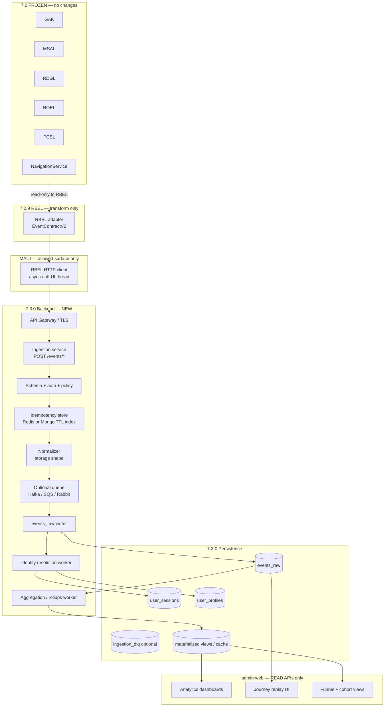

# User Intelligence System (7.3.0) — architecture specification

**Status:** Backend **MVP implemented** (ingestion + Mongo collections + identity upserts + admin read APIs). MAUI RBEL HTTP client is **not** wired in this step (no 7.2 behavior change).  
**Runtime:** **Does not modify** any 7.2 component (GAK, MSAL, RDGL, ROEL, PCSL, PCGL).

### Implemented backend (reference)

| Item | Location / detail |
|------|-------------------|
| Ingest | `POST /api/v1/intelligence/events/batch`, `POST /api/v1/intelligence/events/single` |
| Auth | `Authorization: Bearer <JWT>` **or** `X-Api-Key: <INTELLIGENCE_INGEST_API_KEY>` (set in env) |
| Admin reads | `GET /api/v1/admin/intelligence/summary`, `GET /api/v1/admin/intelligence/journeys/:correlationId` (ADMIN JWT) |
| Collections | `uis_events_raw`, `uis_user_sessions`, `uis_user_profiles`, `uis_device_profiles` |
| Code | `backend/src/models/intelligence-*.model.js`, `services/intelligence-events.service.js`, `routes/intelligence*.js` |
| Tests | `backend/tests/backend.integration.test.js` — describe `7.3.0 — Intelligence ingestion`; Jest uses **`MongoMemoryReplSet`** (required for existing admin transactions with Mongoose 9) |

**Upstream contract:** This system **accepts input only** as **RBEL-normalized EventContractV2** envelopes (see [bridge/runtime_to_business_event_bridge_layer_rbel_spec.md](../bridge/runtime_to_business_event_bridge_layer_rbel_spec.md)).

**Principle:** 7.3.0 is a **pure asynchronous business layer**. It must **never** affect geofence timing, navigation latency, UI responsiveness, MSAL correctness, or GAK determinism.

---

## 1. Full system architecture diagram



**Data law:** Arrows **from** backend **never** return to 7.2 runtime. **No** webhook that calls the app to change location or selection. Admin and analytics are **read-only** relative to the mobile runtime.

---

## 2. Event ingestion API specification

Base path is illustrative: **`/api/v1/intelligence/events`** (prefix chosen to avoid collision with existing **`/api/v1/`** POI/auth routes; governance may merge under a single gateway with routing rules).

### 2.1 `POST /events/batch` (primary)

**Purpose:** Accept a bounded array of **EventContractV2** documents produced by RBEL.

**Headers**

| Header | Required | Description |
|--------|----------|-------------|
| `Authorization` | Yes | `Bearer <JWT>` for authenticated users, or |
| `X-Api-Key` | Conditional | Device-scoped key for **guest / high-volume** ingestion if product policy allows |
| `Content-Type` | Yes | `application/json` |
| `X-Device-Id` | Recommended | Must match every event’s `deviceId` in batch, or request is rejected (anti-spoof) |
| `X-RBEL-Mapping-Version` | Optional | Echo `rbelMappingVersion` for server-side compatibility checks |

**Request body**

```json
{
  "schema": "event-contract-v2",
  "rbelMappingVersion": "rbel-1.0.0",
  "sentAt": "2026-04-18T12:00:00.000Z",
  "events": [
    {
      "contractVersion": "v2",
      "eventId": "uuid-per-event",
      "correlationId": "uuid-required",
      "sessionId": "string",
      "deviceId": "string-required",
      "userId": null,
      "authState": "guest",
      "userType": "guest",
      "sourceSystem": "GAK",
      "rbelEventFamily": "location",
      "rbelMappingVersion": "rbel-1.0.0",
      "runtimeTickUtcTicks": 638800000000000000,
      "runtimeSequence": 1,
      "timestamp": "2026-04-18T12:00:00.000Z",
      "actionType": "geofence",
      "latitude": 10.0,
      "longitude": 106.0,
      "payload": {}
    }
  ]
}
```

**`payload`:** Opaque JSON per **eventFamily** (coordinates, `coalescedSkip`, MSAL source enum, route string, ROEL anomaly class, etc.). Server stores verbatim in **`events_raw.payload`** after size limits (e.g. max 16 KB per payload).

**Response `200`**

```json
{
  "accepted": 48,
  "rejected": 2,
  "duplicate": 0,
  "requestId": "server-trace-id",
  "errors": [
    { "index": 3, "code": "SCHEMA", "message": "missing correlationId" }
  ]
}
```

**Response `401` / `403`:** Auth failure.  
**Response `429`:** Rate limit per `deviceId` + IP.  
**Response `413`:** Batch too large.

**Limits (recommended)**

| Limit | Value |
|-------|--------|
| Max events per batch | 100 |
| Max body size | 512 KB |
| Rate limit | e.g. 30 batches / minute / device (tune per product) |

### 2.2 `POST /events/single` (optional)

Same validation as one element of `events[]`; convenience for low-latency probes or tiny clients. **Same auth and idempotency** rules. Prefer batch in production mobile clients.

### 2.3 Ingestion service responsibilities

1. **Authenticate:** JWT subject must align with `userId` when `userId` is non-null; for guests, **device-bound API key** or **anonymous JWT** with `deviceId` claim.  
2. **Validate schema:** Required V2 fields per RBEL spec (`deviceId`, `correlationId`, `authState`, `sourceSystem`, `rbelEventFamily`, `timestamp`, `contractVersion`). Reject inconsistent `authState` vs `userType`.  
3. **Idempotency:** Before insert, check composite key **`(deviceId, correlationId, runtimeSequence)`** — if `runtimeSequence` is null, fall back to **`(deviceId, eventId)`** when `eventId` present.  
4. **Normalize:** Map wire JSON to **`events_raw`** document (add server `createdAt`, `ingestionRequestId`).  
5. **Forward:** Write to **`events_raw`**; enqueue **async** jobs for identity resolution and aggregation (do not block HTTP on heavy graph work).

### 2.4 MUST NOT (ingestion)

- **Never** invoke or reference GAK, MSAL, ROEL, PCSL, RDGL, or MAUI APIs.  
- **Never** block on downstream analytics completion before returning `200`.  
- **Never** trust `authState` or `userType` as authorization for **admin** routes — use separate RBAC.

### 2.5 Horizontal scalability

- **Stateless** ingestion pods behind a load balancer.  
- **Idempotency:** central **Redis** `SET NX` with TTL **or** Mongo partial unique index on `(deviceId, correlationId, runtimeSequence)` where `runtimeSequence` is always populated (RBEL SHOULD always set it).  
- **Write path:** append-only **`events_raw`**; partition/shard by **`deviceId` hash** or time-range collections (`events_raw_2026_04`) for very large scale.  
- **Read path for admin:** served from **aggregates** and **indexed queries**, not full table scans on raw events for dashboards.

---

## 3. MongoDB schema design

Naming uses **snake_case** in BSON fields for consistency with many Node/Mongo stacks; adjust to camelCase if the existing backend standard differs.

### 3.1 Collection: `events_raw`

**Purpose:** Immutable append log of all accepted RBEL events.

| Field | Type | Index | Description |
|-------|------|-------|-------------|
| `_id` | ObjectId | PK | Server-generated |
| `event_id` | string | unique sparse | Client `eventId`; optional if dedupe uses composite only |
| `correlation_id` | string | compound | RBEL `correlationId` |
| `user_id` | string \| null | compound | Nullable guest |
| `device_id` | string | compound, shard key candidate | Required |
| `auth_state` | string | — | `guest` \| `logged_in` \| `premium` |
| `source_system` | string | — | `GAK` \| `MSAL` \| `NAV` \| `ROEL` |
| `event_family` | string | — | `LocationEvent` \| `UserInteractionEvent` \| `NavigationEvent` \| `ObservabilityEvent` |
| `payload` | object | — | Raw RBEL extension JSON |
| `runtime_tick_utc_ticks` | long \| null | compound | Ordering |
| `runtime_sequence` | long \| null | compound | Ordering within correlation |
| `contract_version` | string | — | `v2` |
| `rbel_mapping_version` | string | — | e.g. `rbel-1.0.0` |
| `timestamp` | date | compound | Event time (from client) |
| `created_at` | date | TTL optional on scratch collections | Server ingest time |
| `ingestion_request_id` | string | — | Server trace |

**Recommended indexes**

- Unique partial: `{ device_id: 1, correlation_id: 1, runtime_sequence: 1 }` where `runtime_sequence` exists.  
- Query: `{ device_id: 1, timestamp: -1 }` for device timeline.  
- Query: `{ correlation_id: 1, runtime_sequence: 1 }` for journey replay.  
- Query: `{ user_id: 1, timestamp: -1 }` for logged-in analytics (nullable `user_id` excluded via partial filter).

### 3.2 Collection: `user_sessions`

**Purpose:** Session grouping and **auth_state transition** history.

| Field | Type | Description |
|-------|------|-------------|
| `_id` | ObjectId | PK |
| `session_id` | string | From RBEL / client; unique per logical session |
| `device_id` | string | Binding |
| `user_id` | string \| null | Null for guest-only session |
| `start_time` | date | First event timestamp in session |
| `last_seen` | date | Updated on each ingested event for session |
| `auth_state_current` | string | Latest derived auth |
| `auth_transitions` | array of `{ at, from, to, source_event_id }` | Audit trail |
| `correlation_ids_sample` | array of string (capped) | Optional debugging; cap length |

**Index:** `{ session_id: 1 }` unique; `{ device_id: 1, last_seen: -1 }`.

### 3.3 Collection: `user_profiles`

**Purpose:** Resolved **identity graph** summary for analytics (not auth source of truth).

| Field | Type | Description |
|-------|------|-------------|
| `_id` | ObjectId | PK |
| `user_id` | string \| null | Null row **disallowed** — only documents with real `user_id` OR use separate **`device_profiles`** for guests (see note) |
| `device_ids` | array of string | Distinct devices observed |
| `role` | string | `guest` \| `login` \| `premium` — **derived** from server auth + event stream |
| `last_active_at` | date | Max timestamp across linked devices |
| `merged_from_user_ids` | array | Optional lineage after support merge |
| `created_at` / `updated_at` | date | — |

**Guest handling:** Either **(A)** store guests only in `user_sessions` + query by `device_id`, or **(B)** add **`device_profiles`** collection (`device_id` PK, `guest_role`, `last_active_at`) so `user_profiles` remains login-centric. Recommended: **(B)** for clean funnel SQL-like analytics.

### 3.4 Optional collections

| Collection | Purpose |
|------------|---------|
| `ingestion_dlq` | Poison batches / schema failures for replay tooling |
| `identity_edges` | Edges `device → user`, `session → user` for graph merges |
| `analytics_rollups_daily` | Pre-aggregated counts for admin dashboards |

---

## 4. Identity resolution model

### 4.1 Inputs

| Input | Source |
|-------|--------|
| `deviceId` | Every event (required) |
| `userId` | Nullable on events; non-null after login |
| `authState` | RBEL hint per event |
| `sessionId` | Client session scope |

### 4.2 Outputs

- **`device_profiles`** row updated:** last seen, inferred guest funnel stage.  
- **`user_profiles` row updated** when `userId` present: append `deviceId` to set, refresh `last_active_at`.  
- **`user_sessions`:** upsert by `session_id`; append `auth_transitions` when `authState` changes between consecutive events.

### 4.3 Rules

| Rule | Behavior |
|------|----------|
| Guest sessions | **Device-bound:** all analytics keyed by `device_id` until login |
| Login merge | On first event with **same `device_id`** and **new non-null `user_id`**, link device → user in **`identity_edges`**; update **`user_profiles.device_ids`** |
| Premium | **`role = premium`** only when **server JWT** (or subscription service) confirms premium; **override** RBEL `authState` if client sends inconsistent premium without valid token |
| Multi-device user | Same `user_id` from different `device_id` values → single **`user_profiles`** document with union of devices |
| Session stitching | Prefer **`correlationId`** within **`sessionId`**; optional heuristic: events within **Δt** (e.g. 30 min) and same `device_id` without explicit session gap |
| Anonymous → authenticated | Transition edge stored; funnel counts **guest device** that later appears linked to **user_id** |

### 4.4 Non-goals

- Identity resolution is **not** real-time auth. **Login/logout** remain on existing auth API.  
- **PII minimization:** store only IDs and coarse geo from RBEL payload policy (product/legal).

---

## 5. Business event processing pipeline

**Ordered stages:** `RBEL (client)` → **`Ingestion HTTP`** → **`Validate + Auth`** → **`Idempotency check`** → **`Normalize`** → **`events_raw` insert** → **`async: Identity worker`** → **`async: Aggregation worker`** → **`materialized views / cache`**.

### 5.1 Batching strategy

| Stage | Strategy |
|-------|----------|
| Client → RBEL | Already defined in RBEL (count + time triggers); **off main thread** |
| HTTP → ingestion | Prefer **batch**; single endpoint for debug |
| Ingestion → queue | Optional: push **normalized** messages for workers to smooth spikes |
| Worker → DB | Bulk `insertMany` where possible; transactional per batch optional |

### 5.2 Retry policy

| Component | Policy |
|-----------|--------|
| MAUI HTTP | Exponential backoff (e.g. 1s, 2s, 4s), max 3 tries; **drop** on persistent failure (never block UI) |
| Ingestion → Mongo | Retry transient write errors; idempotency prevents duplicates |
| Workers | At-least-once delivery from queue; workers **re-idempotent** on `events_raw._id` or unique key |

### 5.3 Ordering guarantees

- **Per journey:** sort by `(runtime_tick_utc_ticks asc, runtime_sequence asc)` within **`correlation_id`**.  
- **Global:** no total order; use **`timestamp`** + **`created_at`** as secondary.  
- **Out-of-order arrival:** ingestion accepts late events; replay UI sorts by the tuple above.

### 5.4 Deduplication rules

| Key | Use |
|-----|-----|
| Primary | `(device_id, correlation_id, runtime_sequence)` |
| Fallback | `(device_id, event_id)` when `event_id` present and `runtime_sequence` missing (legacy) |
| Server | Optional hash of canonical JSON body for accidental double-post |

### 5.5 Correlation grouping

- **`correlation_id`** is the **primary join key** for journey reconstruction.  
- Secondary: **`session_id`** for session-scoped funnels.  
- **Do not** infer correlation server-side from GPS alone (avoid false joins).

---

## 6. Admin-web analytics feature map

All features are **read-only** over 7.3 APIs backed by Mongo (or read replicas). **No** writes to MAUI or runtime.

### 6.1 User analytics

| Feature | Data source | Notes |
|---------|--------------|--------|
| Guest vs logged-in vs premium counts | `device_profiles`, `user_profiles`, rollups | Premium verified against **auth service**, not events alone |
| Conversion funnel | `guest → logged_in → premium` | Stitch via identity edges + first/last transition timestamps |
| Cohorts | `session_id`, `device_id`, signup date | Define cohort keys in rollup job |

### 6.2 Behavior analytics

| Feature | Data source |
|---------|-------------|
| POI interactions | `event_family = UserInteractionEvent` + `poiCode` in payload / top-level fields |
| Navigation flows | `NavigationEvent` sequences grouped by `session_id` or `correlation_id` |
| Geofence-triggered events | `LocationEvent` + `actionType` / payload markers |

### 6.3 Replay system

| Feature | Behavior |
|---------|----------|
| Journey by `correlation_id` | Query `events_raw` filtered by `correlation_id`, sort by `(runtime_tick_utc_ticks, runtime_sequence)` |
| Timeline stream | Paginated API `GET /intelligence/journeys/:correlationId/events?cursor=` |
| Export | CSV/JSON export for ops (RBAC **ADMIN** only) |

### 6.4 API surface (admin — illustrative)

- `GET /api/v1/intelligence/analytics/summary?from=&to=`  
- `GET /api/v1/intelligence/funnel?steps=guest,login,premium`  
- `GET /api/v1/intelligence/journeys/:correlationId`  
- **Separate** from existing **`/api/v1/admin/pois/*`** moderation APIs.

---

## 7. Strict architecture boundary enforcement

### 7.1 MUST NOT

| # | Rule |
|---|------|
| 1 | Do **not** modify GAK, MSAL, RDGL, ROEL, PCSL, PCGL, or RBEL **transformation semantics** from the backend. |
| 2 | Do **not** add business rules inside MAUI runtime DI for intelligence (no “smart” kernel). |
| 3 | Do **not** write Mongo (or any DB) from the **MAUI** app for 7.3.0 analytics. |
| 4 | Do **not** bypass RBEL: ingestion **only** accepts **EventContractV2** as emitted by the RBEL contract. |
| 5 | Do **not** implement **callbacks** or push channels from backend → app that alter navigation, selection, or location. |
| 6 | Do **not** use **`ObservabilityEvent`** alone for billing or entitlement. |

### 7.2 ONLY accepted input

- **RBEL EventContractV2** JSON (batch or single). No raw ROEL structs on the wire for 7.3.0 baseline.

### 7.3 Optional safe integration hooks

| Hook | Direction | Contract |
|------|-----------|----------|
| RBEL → HTTP client (MAUI) | Outbound only | HTTPS, async, bounded queue; **no** await on UI thread |
| Backend ingestion API | Inbound | As §2 |
| Admin-web | Read-only GET | JWT **ADMIN** (or analytics role); pagination mandatory |

---

## 8. Failure modes and scaling risks

| Risk | Mode | Mitigation |
|------|------|------------|
| Client spam | Many batches / device | Rate limit; WAF; API key rotation |
| Duplicate events | Retries | Idempotency key §5.4 |
| Clock skew | Bad `timestamp` ordering | Trust `runtime_tick_utc_ticks` first; server `created_at` for audit; reject events > **5 min** future skew |
| Large payloads | BSON size / cost | Cap `payload`; reject oversize |
| Mongo write hotspot | Single shard | Shard by `device_id` + time partitioning |
| Worker lag | Backlog growth | Autoscale workers; alert on queue depth |
| PII / compliance | Geo in events | Policy in RBEL payload minimization; retention TTL on `events_raw` if required |
| False premium | Client lies | Server derives premium from **auth/subscription**, not `authState` alone |
| Replay abuse | Heavy `correlation_id` scans | RBAC + rate limit + index coverage |
| Identity merge wrong | Same device shared | Rare edge case; support tooling + `merged_from` audit |

---

## 9. Traceability matrix

| 7.3 component | Depends on | Must never depend on |
|---------------|-------------|------------------------|
| Ingestion | RBEL V2, JWT/API key | ROEL in-process buffer |
| Storage | Normalized V2 | Raw MAUI `AppState` |
| Identity | `events_raw` stream | MSAL internal queue |
| Admin-web | Read APIs + rollups | Direct MAUI IPC |

---

## 10. Document control

| Version | Description |
|---------|-------------|
| 7.3.0 | Initial UIS specification (this document) |

**Related:** [bridge/runtime_to_business_event_bridge_layer_rbel_spec.md](../bridge/runtime_to_business_event_bridge_layer_rbel_spec.md) · [architecture_v7_2_system_reconciliation_baseline.md](../architecture_v7_2_system_reconciliation_baseline.md) · [governance/runtime_governance_policy_v7_2_8.md](../governance/runtime_governance_policy_v7_2_8.md)
