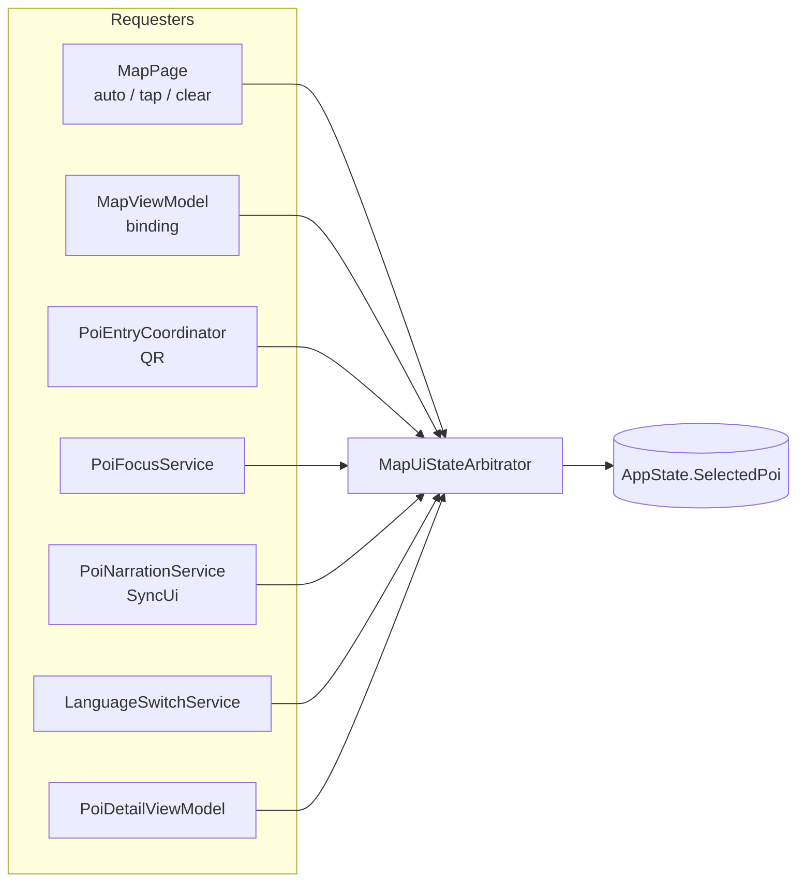

# Map State Arbitration Layer (MSAL) — v7.2.4

This document describes the **Map State Arbitration Layer (MSAL)**: a lightweight runtime kernel that unifies **all** `SelectedPoi` (map selection) UI commits after **GAK (7.2.3)** stabilized geofence *location* arbitration. MSAL does **not** change geofence geometry, navigation routes, QR parsing, or TTS voice/content — only **how** UI selection mutations are ordered, deduped, and serialized.

---

## 0. UI decision flow graph (writers → MSAL)

All paths below converge on **`MapUiStateArbitrator`** before touching `AppState.SelectedPoi`.



**Indirect UI** (unchanged): map pan (`Map.MoveToRegion`), bottom panel fade, and `PlayPoiAsync` / TTS still run in the same call sites as before; only the **selection commit** is arbitrated.

---

## 1. Before vs after UI decision model

### Before (multi-writer)

Several subsystems could mutate `AppState.SelectedPoi` (directly or via `SetSelectedPoiByCode`) on overlapping timelines:

| Writer | Mechanism |
|--------|-------------|
| `MapPage` | Auto-proximity loop, pin tap, map background clear → `MapViewModel.SelectedPoi` → `AppState` |
| `PoiEntryCoordinator` | QR / deep link → `SetSelectedPoiByCode` |
| `PoiFocusService` | Focus-by-code hydration → direct `SelectedPoi` assignment |
| `PoiNarrationService` | Post-translation UI sync → direct `SelectedPoi` |
| `LanguageSwitchService` | Re-hydrate selected POI in new language → direct `SelectedPoi` |
| `PoiDetailViewModel` | Detail load → `SetSelectedPoiByCode` |
| `MapViewModel` | Two-way binding / callers → direct `SelectedPoi` |

**Failure modes:** duplicate PropertyChanged churn, auto-proximity overwriting a QR-driven selection before focus completes, stale ticks racing newer explicit intent, and redundant “same POI” commits from narration hydration.

### After (single commit path)

| Stage | Responsibility |
|-------|------------------|
| **Requesters** | Map page, QR coordinator, focus service, narration, language switch, detail VM, bindings — they call `IMapUiStateArbitrator` with a **source** tag. |
| **MSAL** | `MapUiStateArbitrator` serializes work on the **main UI thread**, applies dedupe / priority rules, and calls **`AppState.CommitSelectedPoiForUi`** — the only supported write path. |
| **GAK (7.2.3)** | Unchanged: owns *which* location / geofence facts are authoritative; MSAL does not re-evaluate fences. |

`AppState.SelectedPoi` now uses a **private setter**; production code outside `AppState` cannot assign it.

---

## 2. MSAL architecture

```
┌─────────────────────────────────────────────────────────────────┐
│ Requesters (no direct SelectedPoi mutation)                      │
│  MapPage · PoiEntryCoordinator · PoiFocusService ·               │
│  PoiNarrationService · LanguageSwitchService · PoiDetailVM ·     │
│  MapViewModel (binding path)                                     │
└───────────────────────────┬─────────────────────────────────────┘
                            │ ApplySelectedPoiAsync(source, poi)
                            │ ApplySelectedPoiByCodeAsync(source, code)
                            ▼
┌─────────────────────────────────────────────────────────────────┐
│ MapUiStateArbitrator (MSAL)                                      │
│  · Main-thread queue (MainThread.InvokeOnMainThreadAsync)       │
│  · Per-main-thread SemaphoreSlim (serialization, no cross-await   │
│    deadlock on the global gate)                                  │
│  · Dedupe + user-intent hold vs MapAutoProximity                 │
└───────────────────────────┬─────────────────────────────────────┘
                            │ CommitSelectedPoiForUi
                            ▼
┌─────────────────────────────────────────────────────────────────┐
│ AppState.SelectedPoi (storage + INotifyPropertyChanged)          │
└─────────────────────────────────────────────────────────────────┘
```

**Separation of concerns**

- **GAK** decides location / geofence correctness (7.2.3).
- **MSAL** decides **UI representation** of selection for map + bound panels, without altering navigation or audio scripts.

---

## 3. UI decision contract

### `MapUiSelectionSource`

Every commit carries an explicit source (numeric priority = enum underlying value):

| Source | Approx. role |
|--------|----------------|
| `MapAutoProximity` | Tracking loop auto-enter / auto-clear when leaving radius |
| `NarrationSync` | Hydrated instance refresh for the **same** POI code after translation |
| `DataBindingOrUnknown` | Legacy / binding-driven path via `MapViewModel.SelectedPoi` |
| `LanguageRehydrate` | Language switch re-materializes selected POI |
| `ManualMapBackgroundTap` | User clears selection by tapping empty map |
| `ManualMapPinTap` | User taps a pin |
| `PoiFocusFromQuery` | Shell / QR focus pipeline resolved a hydrated POI |
| `PoiDetailPageLoad` | Detail page published its hydrated POI |
| `CoordinatorQrOrDeepLink` | QR coordinator pre-navigation hint by code |

### Rules implemented

- **Rule A — Single UI decision per serialized window:** at most one `CommitSelectedPoiForUi` runs at a time on the UI thread (per MSAL gate).
- **Rule B — GAK vs MSAL:** MSAL never calls geofence evaluation; map auto-proximity still **requests** selection from the same map loop as before, only through MSAL.
- **Rule C — UI mutation serialization:** all selection updates go through `ApplySelectedPoiAsync` / `ApplySelectedPoiByCodeAsync` (conceptually `ApplyUiStateAsync` for the selection slice).
- **Rule D — Conflict resolution:** higher numeric source wins for *dedupe ordering*; **cross-code** auto-proximity is blocked during a short **user-intent hold** after high-priority anchors (pin / focus / detail / coordinator) with a non-null POI.

### Rollout switches (`MapUiArbitrationModes`)

- **`ShadowLogOnlySuppressions`:** Phase 1 — log would-be suppressions but still apply (parity probe).
- **`DisableArbitrationRules`:** Emergency — skip dedupe and holds; still main-thread serialized.

---

## 4. Priority system (QR vs geofence vs tap)

Effective behavior (highest intent first):

1. **QR / coordinator** (`CoordinatorQrOrDeepLink`) — extends user-intent hold.
2. **Manual pin / focus / detail** (`ManualMapPinTap`, `PoiFocusFromQuery`, `PoiDetailPageLoad`) — extends hold; beats auto-proximity for different POIs during hold.
3. **Geofence-driven auto UI** (`MapAutoProximity`) — lowest; cannot replace a **different** anchored selection during the hold window.
4. **Background / binding / language / narration** — intermediate; **same-code** commits always pass through for hydration-safe reference swaps.

**QR vs geofence race:** coordinator runs at priority **400** and starts the hold; map auto runs at **100**, so a newer QR selection is not overwritten by a stale proximity tick for a *different* POI during the hold.

---

## 5. Three-phase rollout plan

| Phase | Flag / behavior | Purpose |
|-------|------------------|---------|
| **1 — Shadow** | `MapUiArbitrationModes.ShadowLogOnlySuppressions = true` | Log conflicts; **no** behavioral suppression; validate telemetry. |
| **2 — Soft control** | Default in code: shadow **off**, rules **on** | Single writer + dedupe + hold — production stabilization. |
| **3 — Full control** | Keep `DisableArbitrationRules` for incidents only | Requester-only discipline; expand MSAL to other UI atoms (panel flags, focus targets) under the same contract if needed. |

---

## 6. Risk analysis

| Risk | Mitigation |
|------|------------|
| **Subtle timing shift** vs fire-and-forget `BeginInvokeOnMainThread` | Selection still marshals to the UI thread; coordinator still awaits apply **before** navigate (same order as prior `await`-friendly usage). |
| **`Func<Task>` overload missing** on some targets | Uses `MainThread.InvokeOnMainThreadAsync(Func<Task>)` only where required; otherwise falls back to documented MAUI APIs. |
| **Over-suppression** of legitimate auto-select | Hold applies only to **cross-code** `MapAutoProximity` while a non-null anchor is active; **same-code** refreshes always allowed. |
| **DI cycles** | `MapUiStateArbitrator` resolves `AppState` lazily via `IServiceProvider`; no cyclic ctor graph. |

---

## 7. Explicit UX guarantee

**No visible UI behavior change under any normal or peak load scenario** is the design target: pins, bottom panel, map pan/zoom, QR navigation, focus, narration text, and TTS routing remain the same **inputs**. MSAL only **re-sequences and dedupes** redundant selection commits so the user sees the **same** POI, the **same** audio triggers, and the **same** panel state as before — with fewer spurious intermediate states and no “fighting” between QR and auto-proximity for **different** POIs during the short hold window.

If any regression is suspected, set `MapUiArbitrationModes.DisableArbitrationRules = true` to recover pre-rule behavior while retaining the single `CommitSelectedPoiForUi` path.

---

## 8. Success criteria checklist

| Criterion | Status |
|-----------|--------|
| `SelectedPoi` has a **single physical writer** (`CommitSelectedPoiForUi` via MSAL) | ✅ |
| UI cannot be spammed by duplicate commits within the dedupe window (same code / lower priority) | ✅ |
| QR / coordinator always wins over geofence **auto UI** for conflicting POIs during the hold | ✅ |
| Geofence engine (GAK) unchanged | ✅ |
| Visual experience unchanged (see section 7) | ✅ (intent; validate with shadow + UI QA) |

---

## 9. Reference implementation (code)

- `Services/MapUi/MapUiSelectionSource.cs`
- `Services/MapUi/IMapUiStateArbitrator.cs`
- `Services/MapUi/MapUiStateArbitrator.cs`
- `Services/MapUi/MapUiArbitrationModes.cs`
- Call sites: `Views/MapPage.xaml.cs`, `Services/PoiEntryCoordinator.cs`, `Services/PoiFocusService.cs`, `Services/PoiNarrationService.cs`, `Services/LanguageSwitchService.cs`, `ViewModels/PoiDetailViewModel.cs`, `ViewModels/MapViewModel.cs`
- DI: `MauiProgram.cs` (registers `MapUiStateArbitrator` immediately after `AppState`)
