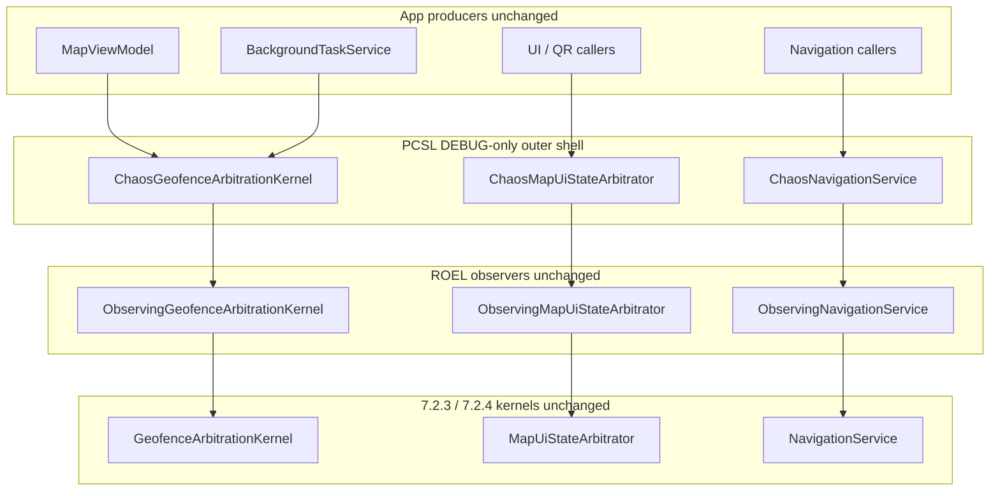

# Production Chaos Simulation Layer (PCSL) — v7.2.7

PCSL validates **GAK**, **MSAL**, **RDGL**, and **ROEL** under synthetic worst-case load **without** editing kernel classes, navigation internals, QR/TTS, geofence decision code, or production UX timing. Chaos is injected **only** at **outer decorators** ahead of the existing ROEL observers.

---

## 1. Chaos model architecture

**Release builds:** PCSL decorators are **not registered**; `IGeofenceArbitrationKernel`, `IMapUiStateArbitrator`, and `INavigationService` resolve directly to ROEL observers (same as pre-7.2.7 behavior).

---

## 2. Injection points map (allowed vs forbidden)

| Allowed (PCSL) | Forbidden |
|------------------|-----------|
| Immediately **before** `ObservingGeofenceArbitrationKernel.PublishLocationAsync` (via `ChaosGeofenceArbitrationKernel`) | Inside `GeofenceArbitrationKernel` |
| Immediately **before** `ObservingMapUiStateArbitrator.Apply*` (`ChaosMapUiStateArbitrator`) | Inside `MapUiStateArbitrator` |
| Immediately **before** `ObservingNavigationService.NavigateToAsync` (`ChaosNavigationService`) | Inside `NavigationService` |
| Synthetic delays / duplicate calls **around** inner ROEL | Mutating `GeofenceService` internals |

---

## 3. Stress scenarios

| Mode (`ChaosSimulationFlags`) | Effect | Target |
|-------------------------------|--------|--------|
| `GpsJitter` | Random micro-offset on lat/lon before publish | GPS noise |
| `GpsBurst` | Extra `PublishLocationAsync` with synthetic producer id | High-frequency spikes |
| `GpsDelay` | Small `Task.Delay` before publish | Stale / slow delivery |
| `GpsReorder` | Two publishes with staggered delays | Ordering stress |
| `UiSpam` | Sequential repeated MSAL applies (same args) | Selection storm |
| `NavStorm` | Sequential rapid `NavigateToAsync` (same route) | Navigation flood |
| `ConcurrencyBurst` | Parallel `PublishLocationAsync` from thread pool | Producer overlap |
| `TelemetryFlood` | Many synthetic `PerformanceAnomaly` ROEL events | ROEL back-pressure |

**Control:** `ChaosSimulationService.Arm(flags, enabled: true)` / `Disarm()` — **DEBUG** arms chaos; **Release** `Arm` is a no-op.

---

## 4. System invariants under chaos

| Layer | Invariant under stress | How to observe |
|-------|------------------------|----------------|
| **GAK** | Still single ingestion API for GPS; coalescing remains inside unchanged kernel | ROEL: `LocationPublishCompleted` vs `GeofenceEvaluated` ratio |
| **MSAL** | Still serializes commits; spam hits outer decorator only | ROEL: `MsalApplyInvoked` / `UiStateCommitted` pairs |
| **RDGL** | Thread-affinity warnings if something mutates `CurrentLocation`/`SelectedPoi` off UI thread | `RuntimeDeterminismGuard` DEBUG logs |
| **ROEL** | Channel drops counted; ordering mostly monotonic by `UtcTicks` | `ChaosValidationEngine.ValidateRecent` |

---

## 5. Failure classification matrix

| Class | Meaning | Example |
|-------|---------|---------|
| **Harmless degradation** | Telemetry drops, DEBUG log noise, transient channel pressure | `TelemetryFlood` with bounded channel |
| **Recoverable instability** | Shell navigation errors under `NavStorm` in DEBUG harness | Operator stops chaos / disarms |
| **Invariant violation (must NOT happen in prod)** | Off-main `SelectedPoi`/`CurrentLocation` writes, bypassing GAK/MSAL | RDGL should surface; fix is **outside** chaos scope per 7.2.7 rules |

---

## 6. Performance stress thresholds (guidance)

| Signal | Suggested investigation threshold |
|--------|-----------------------------------|
| GPS publishes / 2 s | > 12 (see `BatteryEfficiencyMonitor` storm heuristic) |
| ROEL drops | Any sustained `DropWrite` warnings from `RuntimeTelemetryService` |
| MSAL spam | `UiSpam` × 5 sequential applies — expect MSAL dedupe / holds to engage; use ROEL timeline |

Thresholds are **diagnostic**, not automatic prod throttles.

---

## 7. Code map

| Type | File |
|------|------|
| Flags / global arm | `Services/Chaos/ChaosSimulationOptions.cs` |
| Arm / disarm API | `Services/Chaos/ChaosSimulationService.cs` |
| GPS chaos | `Services/Chaos/ChaosGeofenceArbitrationKernel.cs` |
| UI chaos | `Services/Chaos/ChaosMapUiStateArbitrator.cs` |
| Nav chaos | `Services/Chaos/ChaosNavigationService.cs` |
| Validation | `Services/Chaos/ChaosValidationEngine.cs` (DEBUG) |
| DI | `MauiProgram.cs` (`#if DEBUG` PCSL wrappers) |

---

## 8. STRICT GUARANTEE SECTION

**This layer does not modify production behavior.** In **Release** configurations, PCSL decorators are **not** registered and `ChaosSimulationOptions.IsEnabled` is **always false**. When chaos is **disarmed** (default) in **DEBUG**, all decorators are strict pass-throughs to ROEL and then to unchanged kernels.

PCSL **only** injects synthetic stress in **controlled DEBUG environments** (explicit `Arm`) to validate that **GAK**, **MSAL**, **RDGL**, and **ROEL** maintain correctness, determinism, and observability under worst-case conditions — **without** altering geofence decision logic, MSAL arbitration rules, navigation semantics, QR/TTS, or user-visible timing in production builds.

---

## 9. Full 7.2 stack

| Step | Layer |
|------|--------|
| 7.2.3 | GAK — location authority |
| 7.2.4 | MSAL — UI selection authority |
| 7.2.5 | RDGL — invariant guard |
| 7.2.6 | ROEL — observability + passive efficiency |
| **7.2.7** | **PCSL — chaos-tested resilience boundaries (DEBUG)** |
