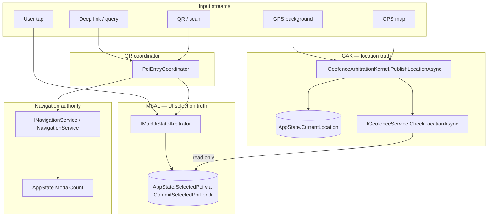

# Runtime Determinism Guard Layer (RDGL) — v7.2.5

This document defines the **Runtime Determinism Guard Layer (RDGL)**: a *contract + observability* envelope around **GAK (7.2.3)**, **MSAL (7.2.4)**, and **navigation**, without merging kernels or changing their behavior. Implementation code under `Services/RuntimeDeterminismGuard.cs` is **DEBUG-only logic** for thread-affinity observability; **release builds are no-ops**.

---

## 1. Full system execution graph

### 1.1 Input streams (who produces raw intent or samples)

| Stream | Typical entry | Notes |
|--------|----------------|-------|
| GPS (map foreground) | `MapViewModel.UpdateLocationAsync` → `ILocationProvider.GetCurrentLocationAsync` | 5s loop from `MapPage` |
| GPS (background) | `BackgroundTaskService.RunLocationLoopAsync` → same provider | Parallel producer label `"background"` |
| QR input | `QrScannerViewModel` / secure scan → `PoiEntryCoordinator.HandleEntryAsync` | Serialized by coordinator mutex |
| User tap | `MapPage` pin / map background | Drives MSAL sources (`ManualMapPinTap`, etc.) |
| Deep link | `DeepLinkCoordinator`, Shell query attributes on `MapPage` / `PoiDetailViewModel` | Becomes coordinator or focus requests |

### 1.2 Decision layers (authoritative roles)



### 1.3 End-to-end narrative (one logical “tick”)

1. **Location sample** arrives from **map** or **background** loop → only **`PublishLocationAsync`** should commit **`CurrentLocation`** (GAK marshals to the main thread, then optionally runs geofence).
2. **Geofence policy** runs in **`GeofenceService.CheckLocationAsync`** (invoked **only** from GAK today). It may **read** `SelectedPoi`, `Pois`, `CurrentLanguage`, `IsModalOpen` — it does **not** write selection.
3. **QR / deep link** → **`PoiEntryCoordinator`** applies selection via **MSAL** (`CoordinatorQrOrDeepLink`), then **`INavigationService`** routes Shell.
4. **User / map UI** → **`MapPage`** / **`MapViewModel`** request selection via **MSAL** with explicit `MapUiSelectionSource`.
5. **Navigation** updates **`ModalCount`** through **`NavigationService`** only (modal stack mirror).

---

## 2. GAK vs MSAL boundary definition

| Concern | Owner | Mutable “truth” | Consumers |
|---------|--------|------------------|-----------|
| Device location sample → `AppState.CurrentLocation` | **GAK** | `CurrentLocation` | Map bindings, distance math, geofence input |
| Geofence evaluation / proximity audio policy | **GAK → GeofenceService** (called from GAK only) | Internal cooldown state in `GeofenceService` | Audio for proximity |
| Map **selection** / bottom-panel binding anchor | **MSAL** | `SelectedPoi` (via `CommitSelectedPoiForUi` only) | Map UI, `GeofenceService` (read for duplicate suppression), narration |
| Route / modal transitions | **NavigationService** | Shell stack + `ModalCount` | Background loops (pause when modal) |

**Hard boundary:** GAK must never call MSAL; MSAL must never publish GPS samples. **Soft coupling (documented):** `GeofenceService` **reads** `SelectedPoi` to avoid double narration when UI already selected the same POI — this is *intentional* coupling, not a second writer.

---

## 3. Drift detection points

### 3.1 Bypass risks (regression magnets)

| Risk | Detection today | RDGL action |
|------|-----------------|-------------|
| Direct `_appState.CurrentLocation =` outside GAK | `rg "CurrentLocation\\s*=" --glob "*.cs"` → should hit **only** `GeofenceArbitrationKernel` + `AppState` accessor | **CI grep** (see §5) |
| Direct `SelectedPoi =` outside `AppState` | **Compile-time**: `SelectedPoi` setter is **private**; external writes must fail build unless they use `CommitSelectedPoiForUi` from MSAL | Compiler + **CI grep** for `CommitSelectedPoiForUi` call sites |
| Direct `IGeofenceService.CheckLocationAsync` bypassing GAK | `rg "CheckLocationAsync"` → only `GeofenceArbitrationKernel` + interface + implementation | **CI grep** |
| Silent second GPS “truth” for **nearby** features | `GetNearbyPoisUseCase` calls **`GetCurrentLocationAsync` directly** — does **not** write `AppState`; uses an **ephemeral** fix for DB query | Document as **read-path drift** (two sources of “where am I” for different features) |

### 3.2 Race amplification points

| Point | Mechanism | Mitigation already in product |
|-------|-----------|-------------------------------|
| Map vs background GPS | Two producers into **`PublishLocationAsync`** | GAK coalescing + ordered main-thread commit |
| QR vs map auto-selection | Coordinator + map loop | MSAL user-intent hold vs `MapAutoProximity` |
| GAK tick vs MSAL | Geofence reads `SelectedPoi` | Same-code suppression in geofence; MSAL serialization on UI thread |
| Foreground map loop + background loop | Both call `PublishLocationAsync` | Single kernel serializes evaluation policy |

### 3.3 Hidden coupling (allowed but frozen)

- **`GeofenceService` → `AppState.SelectedPoi` (read)** for “already selected” suppression.
- **`GeofenceService` → `AppState.Pois` / `CurrentLanguage` / `IsModalOpen`** for evaluation context.
- **`NavigationService` → `AppState.ModalCount`** for global modal awareness.

These are **not** MSAL/GAK violations; they are **read** or **nav-adjacent** writes explicitly owned by their services.

---

## 4. Invariant rules (Invariant Engine)

### Rule 1 — Location truth

**Only GAK** may assign **`AppState.CurrentLocation`** (today: exclusively inside `GeofenceArbitrationKernel` on the main thread).  
**Corollary:** No feature may persist a competing “global GPS” in `AppState` without extending this rule in a **visible** architecture change.

### Rule 2 — UI selection truth

**Only MSAL** (`MapUiStateArbitrator`) may call **`AppState.CommitSelectedPoiForUi`**.  
**Corollary:** `SelectedPoi` has no public setter; bypass requires changing `AppState` — should be caught in review.

### Rule 3 — Navigation isolation

**Shell transitions** and **modal stack** mutations go through **`INavigationService`** implementations; **`ModalCount`** is updated there to mirror Shell — not from random pages.

### Rule 4 — No cross-layer direct writes

- Do not call **`CheckLocationAsync`** except from GAK.
- Do not assign **`CurrentLocation`** except from GAK.
- Do not assign **`SelectedPoi`** except via **`CommitSelectedPoiForUi`** from MSAL.

---

## 5. Future-proofing layer (anti-regression)

### 5.1 DEBUG: `RuntimeDeterminismGuard`

- **File:** `Services/RuntimeDeterminismGuard.cs`
- **Behavior (DEBUG only):** subscribes to `AppState.PropertyChanged` for **`SelectedPoi`** and **`CurrentLocation`**; if either changes **off** the main UI thread, emits **`Debug.WriteLine`** + **`LogWarning`**.
- **Release:** no-op constructor; **zero UX/timing impact**.
- **Eager attach:** `App` constructor resolves the singleton so the subscription exists from startup.

This does **not** prove caller identity (GAK vs MSAL), but it **detects** the most common silent regression: **cross-thread mutation** of the two global “truth” properties.

### 5.2 CI / pre-commit grep suite (mandatory for “full traceability”)

Run in repo root; **expect zero matches** outside allowlisted files:

```text
# Location truth bypass
rg "_appState\\.CurrentLocation\\s*=" --glob "*.cs"
rg "CurrentLocation\\s*=" Services --glob "*.cs"

# Geofence entry bypass (allow GeofenceArbitrationKernel, GeofenceService, IGeofenceService)
rg "\\.CheckLocationAsync\\(" --glob "*.cs"

# Selection bypass (allow AppState + MapUiStateArbitrator)
rg "CommitSelectedPoiForUi" --glob "*.cs"
```

Maintain **allowlists** in PR template when a match is intentional (should be rare).

### 5.3 Code review checklist (human layer)

1. Any new `AppState` mutation → classify as **GAK / MSAL / Nav / other**; justify if “other”.
2. Any new GPS pipeline → must call **`PublishLocationAsync`**, not raw `AppState`.
3. Any new selection path → must call **`IMapUiStateArbitrator`** with a **new or existing** `MapUiSelectionSource`.
4. Any new `Task` continuation that touches UI state → confirm **main-thread** marshaling matches existing patterns.

---

## 6. Risk analysis

| Risk | Severity | Mitigation |
|------|----------|------------|
| **False sense of completeness** — RDGL cannot see all logic bugs | Medium | Pair DEBUG guard with **CI grep** + review checklist |
| **Dual read paths for GPS** (`GetNearbyPoisUseCase`) | Low–Medium | Documented; does not violate Rule 1 *writes*; may confuse future features | 
| **`Debug.WriteLine` noise** in stress tests | Low | Guard is DEBUG-only; tune logger filters |
| **Someone removes eager `GetRequiredService`** | Low | MSAL/GAK unchanged; only observability drops |

---

## 7. Explicit guarantee statement

**Within the assumptions of this document** — namely: (a) **Rule 1–4** remain the documented contract, (b) **CI grep rules** in §5.2 are enforced on every merge, and (c) **DEBUG** builds run with **`RuntimeDeterminismGuard`** attached — **no silent architectural regression can reintroduce the classified bypass or cross-layer write paths** (`CurrentLocation` writes outside GAK, `CheckLocationAsync` outside GAK, `SelectedPoi` commits outside MSAL, or **off-main-thread** mutations of `CurrentLocation` / `SelectedPoi`) **without being detected** by at least one of: **compiler failure**, **CI grep failure**, **DEBUG runtime warning**, or **required code review**.

This is intentionally **not** a claim of total correctness for all possible races in the universe — it is a claim about **this model’s** detection surface for the **documented** regression classes.

---

## 8. Relation to v7.2.3 / v7.2.4

| Layer | Doc | Role |
|-------|-----|------|
| GAK | `docs/geofence_arbitration_kernel_design.md` (and v7.2.3 deliverables) | Location + serialized geofence evaluation |
| MSAL | `docs/map_state_arbitration_layer_v7_2_4.md` | Serialized UI selection |
| RDGL | **this file** | Cross-layer invariants + anti-regression |

Together they form a **race-condition-resistant runtime architecture** *by construction and by enforcement*, while preserving **unchanged UX timing** in production release builds.
