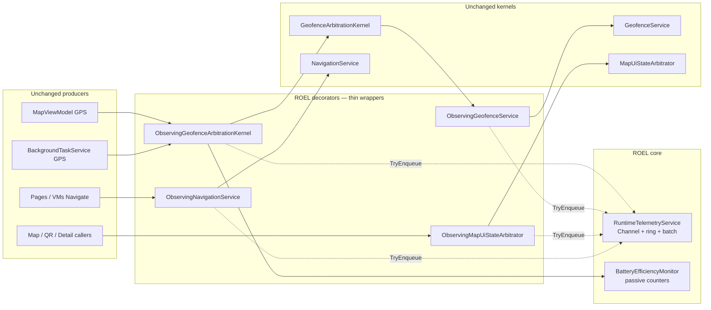

# Runtime Observability + Efficiency Layer (ROEL) — v7.2.6

ROEL adds **production-safe telemetry**, **passive battery/performance signals**, and a **DEBUG replay** view **without** modifying `GeofenceArbitrationKernel` (GAK), `MapUiStateArbitrator` (MSAL), navigation internals, QR/TTS, UX timing, or geofence decision logic. All hooks are **DI decorators** + a **non-blocking** `Channel` pipeline.

---

## 1. Observability architecture

**Rules**

- **Never block** producers: `TryWrite` to a bounded `Channel`; on pressure, events are dropped and counted (best-effort).
- **Never run heavy work** on the hot path: only struct events + `TryWrite` + lightweight counters under a short lock in `BatteryEfficiencyMonitor`.
- **GAK / MSAL / NavigationService** class files are **unchanged**; behavior is identical because decorators **always** forward to the registered concrete instances.

---

## 2. Telemetry event schema

| `RuntimeTelemetryEventKind` | When emitted | Key fields |
|----------------------------|----------------|------------|
| `GpsTickReceived` | Before `PublishLocationAsync` enters GAK | `ProducerId`, lat/lon |
| `LocationPublishCompleted` | After `PublishLocationAsync` returns | Same |
| `GeofenceEvaluated` | Before `CheckLocationAsync` on inner service | lat/lon |
| `MsalApplyInvoked` | Before MSAL apply / by-code | `Detail` = source + before/requested |
| `UiStateCommitted` | After MSAL await | `PoiCode` = after code, `Detail` = diff summary |
| `NavigationExecuted` | Before each nav API | `RouteOrAction`, `Detail` |
| `PotentialDuplicateGpsObserved` | Passive: wrapper sees ~same fix within 400 ms / 3 m | diagnostic only; **inner still runs** |
| `PerformanceAnomaly` | Passive: tick storm heuristic | e.g. many publishes in 2 s window |
| `TelemetryDropped` | (reserved) channel overflow accounting via logs | — |

**Coalescing inference:** GAK coalescing is internal; ROEL compares **`LocationPublishCompleted`** count vs **`GeofenceEvaluated`** count over a window to infer “merged/dropped geofence ticks” in replay analysis (no synchronous peek inside GAK).

---

## 3. Battery optimization strategies (non-functional only)

| Strategy | Implementation | Behavioral impact |
|----------|----------------|-------------------|
| **Duplicate GPS observation** | `BatteryEfficiencyMonitor` detects near-duplicate samples; emits `PotentialDuplicateGpsObserved` | **None** — GAK still receives every publish |
| **Tick storm detection** | Counts publishes in a sliding window; logs + `PerformanceAnomaly` | **None** |
| **Telemetry batching** | Single reader drains up to 64 events per wake | Reduces logger / file I/O cost only |
| **Ring buffer cap** | 1024 events in memory for replay | Drops oldest telemetry entries only |
| **DEBUG NDJSON export** | `FileSystem.AppDataDirectory/roel/telemetry.ndjson` | **DEBUG builds only**; no effect on Release UX |

**Explicitly not done (would violate constraints):** skipping `PublishLocationAsync`, skipping `CheckLocationAsync`, changing MSAL suppression rules, or coalescing navigation calls.

---

## 4. Replay engine design (DEBUG)

| Component | Role |
|-----------|------|
| `RuntimeReplayEngine` | Resolves `IRuntimeTelemetry`, exposes `ExportRecent` + `BuildTextTimeline` sorted by `UtcTicks` |
| `IRuntimeTelemetry.GetRecentSnapshot` | Returns FIFO slice of the ring buffer (up to *N*) |
| NDJSON file | Optional durable stream for external tooling |

**Reconstruction recipe:** sort by `UtcTicks`, then align sequences `GpsTickReceived` → `LocationPublishCompleted` → `GeofenceEvaluated` → `MsalApplyInvoked` → `UiStateCommitted` → `NavigationExecuted`.

---

## 5. Telemetry point map (code)

| Layer | File | What is logged |
|-------|------|------------------|
| GAK ingress | `ObservingGeofenceArbitrationKernel.cs` | GPS tick, publish completion, battery hints |
| Geofence eval | `ObservingGeofenceService.cs` | Each `CheckLocationAsync` |
| MSAL | `ObservingMapUiStateArbitrator.cs` | Apply + committed snapshot |
| Navigation | `ObservingNavigationService.cs` | Modal + route + go back |
| Pipeline | `RuntimeTelemetryService.cs` | Channel drain, ring, DEBUG file |
| Passive efficiency | `BatteryEfficiencyMonitor.cs` | Duplicate / storm heuristics |

**DI wiring:** `MauiProgram.cs` registers concrete kernels/services, then **decorated** `IGeofenceService`, `IGeofenceArbitrationKernel`, `IMapUiStateArbitrator`, `INavigationService`.

**Startup:** `App.xaml.cs` resolves `RuntimeTelemetryService` so the background processor is running immediately.

---

## 6. Performance risk analysis

| Risk | Mitigation |
|------|------------|
| Channel memory growth | Bounded channel + `DropWrite` |
| Ring / file I/O cost | Ring capped; file append **DEBUG only** |
| Lock contention in `BatteryEfficiencyMonitor` | Tiny critical section; GPS is low frequency |
| Decorator depth / allocations | Two tiny structs per GPS tick + one per geofence eval — target well under 1 ms added wall time on device class hardware |
| Misinterpretation of telemetry | Documented inference rules; MSAL “suppression” not logged directly (kernel unchanged) |

---

## 7. STRICT GUARANTEE SECTION

**This layer introduces zero behavioral changes to user experience, geofence timing, navigation flow, or UI state transitions.** It only observes, measures, and records redundant or anomalous patterns (without suppressing kernel calls). All decisions remain in **GAK**, **MSAL**, and **NavigationService** implementations exactly as before; ROEL only wraps public interfaces and forwards identical arguments.

---

## 8. Relation to 7.2.3–7.2.5

| Version | Layer |
|---------|--------|
| 7.2.3 | GAK — location + geofence evaluation authority |
| 7.2.4 | MSAL — UI selection authority |
| 7.2.5 | RDGL — invariants + regression guard |
| **7.2.6** | **ROEL** — observability + passive efficiency + DEBUG replay |

Together they form a **fully observable, deterministic, performance-aware runtime architecture** (observability and passive detection here; determinism from GAK/MSAL/RDGL).

---

## 9. Success criteria checklist

| Criterion | Status |
|-----------|--------|
| No change in GAK outputs for identical inputs | ✅ (forward-only decorators) |
| No change in MSAL outputs | ✅ |
| No navigation semantic change | ✅ |
| Redundant / anomalous processing **detectable** | ✅ (`PotentialDuplicateGpsObserved`, `PerformanceAnomaly`) |
| Full traceability of GPS → GAK publish → geofence → MSAL → nav | ✅ (event kinds + ordering) |
