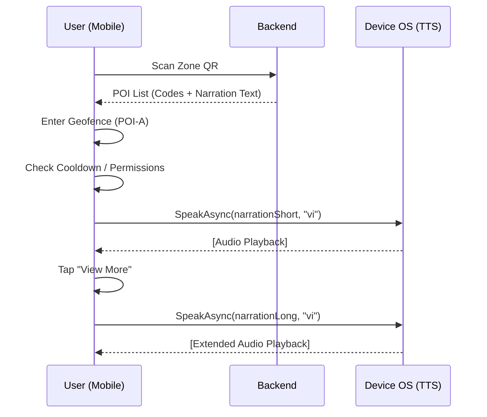

# 🌐 VN-GO Travel: Translation & Audio System Flow

**Version:** 1.0  
**Status:** Audited & Documented  
**Date:** 2026-04-30  

---

## 📖 System Overview

VN-GO Travel is a location-based audio guide system. To ensure high availability and low latency, it employs a **hybrid architecture** for translations and a **runtime generation** model for audio.

- **Translation**: Multi-language text is stored in MongoDB, synchronized to mobile devices via JSON language packs, and stored locally for offline use.
- **Audio**: Audio is generated **on-the-fly** via Client-Side Text-to-Speech (TTS), eliminating the need for large audio file hosting and streaming bandwidth.

---

## 🏗️ Translation Pipeline

### 1. Data Structure
The system uses a "Primary + Extension" model for POI content:

| Collection | Role | Key Fields |
| :--- | :--- | :--- |
| `pois` | Primary Metadata | `code`, `location`, `radius`, `name` (vi), `narrationShort` (vi) |
| `poi_contents` | Localized Content | `poiCode`, `language`, `title`, `description`, `narrationShort`, `narrationLong` |

### 2. Pipeline Flow
1.  **Ingestion**: Owners or Admins submit text via the **Web Dashboard**.
2.  **Dual-Write**: The `PoiService` (Backend) performs a dual-write:
    - Updates the primary record in the `pois` collection.
    - Creates/Updates a corresponding record in `poi_contents` for that language.
3.  **Synchronization**: 
    - **Delta Sync**: Mobile clients call `GET /api/v1/pois/check-sync?lastSyncTime=...` to fetch only changed POI codes.
    - **Bulk Sync**: `LanguagePackService` aggregates all `poi_contents` for a specific language (e.g., 'ja') into a single JSON "Language Pack" for offline download.

### 3. Language Handling
- **Primary Language**: Vietnamese (`vi`).
- **Supported Fallback**: If a translation is missing, the system defaults to the `vi` content stored in the `pois` collection.
- **Storage Format**: Standard BCP-47 language tags (vi, en, ja, ko, etc.).

---

## 🎙️ Audio Pipeline

### 1. Generation Architecture
Contrary to traditional pre-recorded systems, VN-GO Travel uses **Runtime TTS**.

- **Mechanism**: The Backend provides the text strings; the Mobile App synthesizes audio.
- **Engine**: MAUI `TextToSpeech.Default.SpeakAsync` (wrapping native iOS `AVSpeechSynthesizer` and Android `TextToSpeech` engine).
- **Storage**: **Zero audio files** are stored for narration. This saves ~5MB per POI per language.

### 2. Audio Metadata (Dormant)
The backend contains an `audio_assets` collection and `audioShortId`/`audioLongId` fields. 
- **Current State**: These fields are **not consumed** by the current mobile client.
- **Purpose**: Future expansion for high-quality pre-recorded human narration or music for specific "Premium POIs".

### 3. Technical Parameters
- **Pitch**: 1.0 (Natural)
- **Volume**: 1.0 (System Default)
- **Locale Mapping**: The mobile app maintains a `LangToLocales` map to ensure the correct native voice is used (e.g., `ja` -> `ja-JP`).

---

## 🔄 Runtime Flow (Scan → Play)

---

## 📶 Offline Flow

The system is designed to work in remote tourist areas with poor connectivity:

1.  **Preparation**: User downloads the "Language Pack" and "Zone Metadata" at the hotel (Wi-Fi).
2.  **Storage**: Metadata is stored in a local SQLite/Internal database.
3.  **Discovery**: `GeofenceService` monitors location via GPS (no internet required).
4.  **Playback**: 
    - `AudioService` fetches text from local storage.
    - Native TTS engine synthesizes audio offline (as long as voice data is pre-installed on the OS).

---

## ⚠️ Current Limitations

| Area | Limitation | Impact |
| :--- | :--- | :--- |
| **Voice Quality** | Dependent on phone settings | Some devices may sound "robotic" if premium voices aren't installed. |
| **TTS Initialization** | Cold-start penalty | First `SpeakAsync` call may lag (~1-2s) due to MAUI `GetLocalesAsync` call. |
| **Schema Redundancy** | Dual-write overhead | Maintaining text in both `pois` and `poi_contents` increases risk of drift. |
| **Offline Voice** | Missing voice data | If a user downloads 'ja' pack but their phone has no Japanese TTS voice, it falls back to English. |

---

## 🚀 Recommendations (Production-Ready)

1.  **Voice Pre-validation**: On app startup, detect if the selected language has a native voice installed. If not, prompt the user to download it from System Settings.
2.  **Hybrid MP3 Fallback**: For "Global Landmark" POIs, use pre-recorded MP3s (via `audioShortId`) to ensure emotional, high-quality delivery, falling back to TTS for smaller POIs.
3.  **TTS Caching**: Implement a "Warm-up" routine during app splash screen to initialize the TTS engine and locale list early.
4.  **Content Versioning**: Strictly use the `version` field in `pois` to trigger `LanguagePack` regeneration automatically via a Database Trigger or Middleware.
